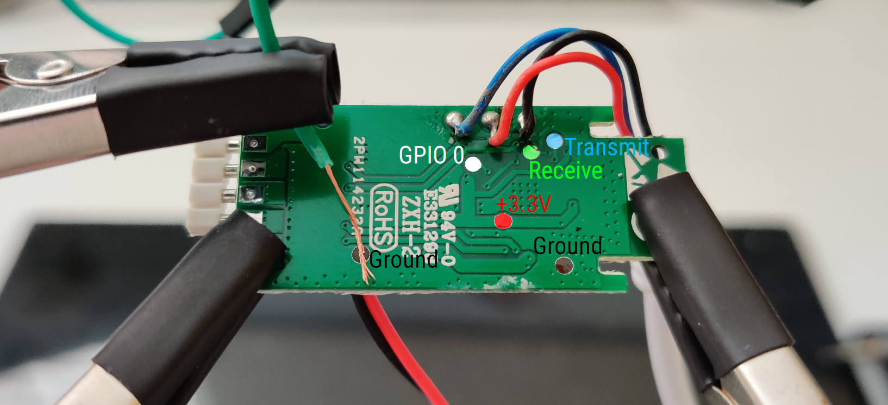
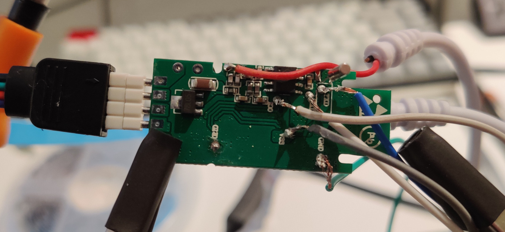

I recently added some RGB LED strips around my headboard and bed frame, because everyone needs more RGB in their life. The only thing better than RGB is internet connected RGB. One of the most common controllers for this is the MagicHome.

The MagicHome comes with its own firmware, which works, but it's not open-source, and judging from the logs it's definitely doing some phoning home. Because it's just an ESP32 underneath, it can be flashed with alternative firmware easily. My choice of which is [ESPHome](https://esphome.io/).

## Requirements

- [MagicHome](https://www.amazon.co.uk/s?k=magic+home+LED)
- Soldering kit (soldering iron, solder, etc)
- Jumper wire
- [USB-TTL Adapter](https://www.amazon.co.uk/s?k=USB+TTL)
- Multimeter (optional) - to check your solders and wiring

If you look for "MagicHome LED" on Amazon, you'll be met with a lot of devices which look the same. Really, they are all the same. I'd recommend not going for the absolute cheapest one, but most of them will be around £10. If you're thinking of buying one with an IR remote so you can use that as a fallback, don't bother. The firmware below won't support that. In theory, it's possible - But that's for a future guide.

## Disassembly

Unlike a NodeMCU, the MagicHome devices don't have USB interfaces, or at least not in the conventional sense. You'll need to make one yourself, sort of. Crack open the case, and look on the back of the PCB. You'll find 6 solder pads, we need 5 of them:



- `VCC` (Power)
- `TXD` (Transmit)
- `RXD` (Receive)
- `GND` (Ground) (There's 2 of these, they're the same)
- `GP0` (GPIO 0)


## Soldering

You'll need to solder wires onto each of these pads individually. Be careful, some solder pads are incredibly close to both other components and eachother, especially `TXD` and `RXD`. I'm not going to tell you how to solder, partly because there are far better guides out there, partly because my soldering techniques should not be copied - The first board I tried this on I ripped off one of the solder pads.



Once all the lines are soldered correctly, connect them to your TTL adapter. Note that the adapter should be running in 3.3V mode (or connect `VCC` to 3.3V rather than 5V). Rather unobviously, although it makes when you think about it, `TXD` and `RXD` need to be swapped when connecting to the adapter - `TXD` should be connected to `RXD` and vice versa. This is so data _transmitted_ by the TTL adapter is _received_ by the MagicHome.

## Firmware

In theory, we now have a USB interface to our MagicHome, now we need the firmware. With ESPHome, this starts with a YAML file.

```yaml
esphome:
  name: bed_led
  platform: ESP8266
  board: esp01_1m

wifi:
  ssid: "XXXXXXX"
  password: "YYYYYYY"

logger:

api:
  password: "ZZZZZZZZ"

ota:
  password: "AAAAAAAAA"

light:
  - platform: rgb
    name: "Bed LED"
    red: red_channel
    green: green_channel
    blue: blue_channel

output:
  - platform: esp8266_pwm
    id: red_channel
    pin: GPIO5
  - platform: esp8266_pwm
    id: blue_channel
    pin: GPIO12
  - platform: esp8266_pwm
    id: green_channel
    pin: GPIO14
```

Much of the configuration is the same as with any other ESPHome device. The important parts are the `light` and `output` keys. This firmware defines 3 output pins for the red, green and blue channels, and combines them to form an RGB LED interface.

You can find a reference on what GPIO pins are available [here](https://templates.blakadder.com/magichome_ZJ-WFMN-B_V1_1.html). The numbers in the above should be correct, but if they're not you might need to have a play around with the pin numbers until you find an exact match. The first example I found had completely different pin layouts, which only had the red channel outputting correctly.

With your YAML file created, compile it and download the binary. Whether you use the CLI or web interface doesn't matter. Personally I use the web interface as it shows whether the boards are working and if there are updates. For more instructions on using ESPHome, check out my [ESPHome DHT Sensor]() post.

## Flashing

Flashing NodeMCUs is simple - Just connect them over USB and click "Flash". Flashing MagicHome's is less so.

Before connecting your TTL adapter to USB, connect the GPIO 0 pin to ground and hold it there whilst plugging in the device. This puts the device into flashing mode so it'll accept new firmware. After a few seconds you can disconnect GPIO 0, although it's not required.

The ESPHome CLI supports compiling and flashing in 1 step. Personally I use the[`esphome-flasher`](https://esphome.io/guides/faq.html#esphome-flasher) utility (available on the [AUR](https://aur.archlinux.org/packages/esphome-flasher)). Now that your board is connected, select it from the dropdown, find your downloaded firmware (`bed_led.bin` in my case) and click "Flash". If all goes well, flashing should complete. If it doesn't, hope that the error messages you're getting are useful. In my case when the solder pad came off, they really weren't!

In theory, once flashing completes, you'll be met with the logs of the booting up MagicHome running ESPHome. If there are no logs, don't worry, it's probably fine&#8482;.

## Usage

Simply connect your newly ESPHome'd MagicHome to HomeAssistant [as you would any other ESPHome device](https://www.home-assistant.io/integrations/esphome/). Thanks to the magic of ESPHome, HomeAssistant should detect it as a light capable of RGB control.

Due to bugs in the existing [`flux_led` integration](https://www.home-assistant.io/integrations/flux_led), commonly used for MagicHome, the ESPHome interface should be much more reliable and update when you want it. It does seem to be marginally slower to turn the lights on or off than before, but nothing annoying.

Now, thanks to ESPHome, you've got a nice 12V capable RGB LED controller, without any proprietary firmware. And I've got a bed with internet-connected RGB!
