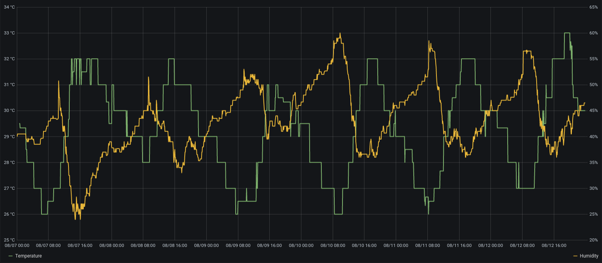
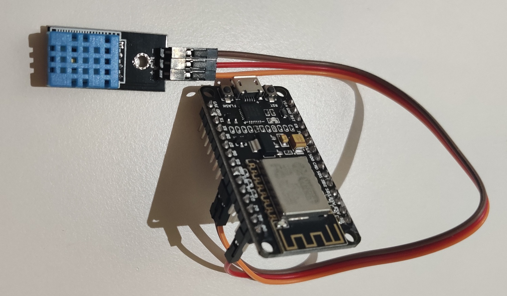
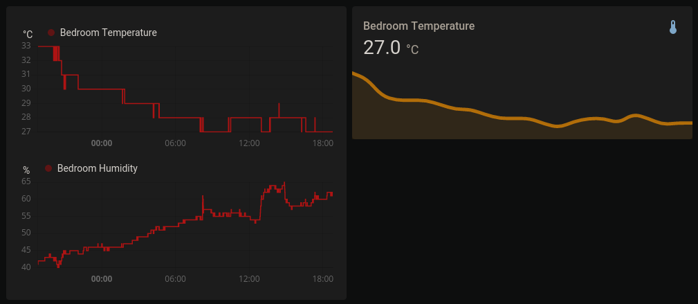

The majority of England (where I live) is being hit by [quite a heatwave](https://www.dailymail.co.uk/news/article-8610963/UK-weather-Britain-swelter-TEN-day-heatwave.html). It's hot here, like really hot!



Us brits are incapable of handling the heat, and enjoy nothing more than telling each other how hot and unbearable it is. I'm definitely guilty of this, and as a ginger, I'm worse than most. When telling people quite how hot it is, wouldn't it be great to have your own sensor in your room, plotting the temperature, and storing the data in home-assistant? Yes? Then you're in the right place.

## Requirements

To build the sensor, you'll need a few things:

- [HomeAssistant](https://www.home-assistant.io/)
- [ESPHome](https://esphome.io/) (installation instructions [below](#install-esphome))

And a few components:

- [ESPHome-compatible](https://esphome.io/#devices) board (I'm using a NodeMCU from [amazon.co.uk](https://www.amazon.co.uk/MakerHawk-Internet-Development-Wireless-Micropython/dp/B07M8Q38LK))
- DHT11 (DHT22 is significantly nicer, but more expensive)
- Jumper cables (often come with the DHT)

## Steps

### Install ESPHome

ESPHome has a few installation methods, however I recommend using [Docker](https://hub.docker.com/r/esphome/esphome) as it presents an incredibly simple to use web UI, and makes interfacing much easier. When using the docker container, you'll need to set `network_mode: host` to support OTA updates and detection.

```yaml
  esphome:
    image: esphome/esphome:latest
    restart: unless-stopped
    network_mode: host
    volumes:
      - ./esphome:/config
```

I have it installed on the same machine HomeAssistant is, but that's not necessary. ESPHome is just the UI - the communication is direct between HomeAssistant and the boards.

Once started, it should be accessible via `<ip>:6052`. Note this UI is unauthenticated, so probably shouldn't be internet-accessible.

### Construct circuit

Constructing your sensor is very simple and doesn't require any soldering.

The first step is to identify the right pins on the DHT sensor. There are 3 pins: ground, power and data. When connecting up your sensor, you'll need to ensure the ground pin is connected to ground, 3.3V is connected to a 3.3v output, and data is connected to one of the data pins.

The pins labelled on the board are not necessarily all accessible to ESPHome, nor are the numbers correct. Be sure to check the [documentation](https://esphome.io/devices/nodemcu_esp8266.html) for the specific board you're using, and connect the pins correctly. In my case, I connected the data line to the pin labelled `D1`.



### Create firmware

Next we need to write the config file which will be turned into our firmware. ESPHome configuration is just `yaml` files, which makes editing and updating simple. The web UI contains a helpful wizard to create the configuration files.

Go to ESPHome, and click the "+" button to start the setup wizard. This will walk you through naming your sensor and connecting it to WiFi. Once created, a card will appear on the homepage for your sensor, showing it as disconnected. Select "Edit" and you'll be presented with a yaml file:

```yaml
esphome:
  name: test_sensor
  platform: ESP8266
  board: esp01_1m

wifi:
  ssid: "test"
  password: "test"

  # Enable fallback hotspot (captive portal) in case wifi connection fails
  ap:
    ssid: "Test Fallback Hotspot"
    password: "oZkrj2ddgl3m"

captive_portal:

# Enable logging
logger:

# Enable Home Assistant API
api:
  password: "my secure password"

ota:
  password: "my secure password"
```

There's a lot of configuration in here which isn't needed for use with HomeAssistant, so we can remove it. Once cleaned up, you should have something similar to this:

```yaml
esphome:
  name: test_sensor
  platform: ESP8266
  board: nodemcuv2

wifi:
  ssid: "test"
  password: test

# Enable logging
logger:

# Enable Home Assistant API
api:
  password: "my secure password"

ota:
  password: "my secure password"
```

With this configuration, The ESPHome firmware will connect to your device WiFi network and expose an API which HomeAssistant can connect to. This API is password protected, and will be needed for the HomeAssistant setup later.

Next we need to set up the sensor. This is done with an additional section in the configuration:

```yaml
sensor:
  - platform: dht
    pin: D1
    temperature:
      name: "My Temperature"
    humidity:
      name: "My Humidity"
    update_interval: 60s
    model: DHT11
```

The sensor names here will correspond to sensor names in HomeAssistant. Be sure to set the correct pin and model for your sensor. The [documentation](https://esphome.io/components/sensor/dht.html) shows the possible values you can set for these.

### Flash firmware

ESPHome has a great feature where you can modify the configuration and update boards wirelessly over the network. Unfortunately, this doesn't work for the initial flash. For this, we have to download the firmware and flash it ourselves.

Before the firmware can be flashed, it must be compiled. This takes the configuration yaml and turns it into a firmware file. To do this, click the 3 dots on the relevant device card and select "Compile". This will take some time (30 seconds or so), after which you'll be presented with `INFO Successfully compiled program.`. At this point, you can click "Download Binary" in the bottom right of the popup to download the `.bin` firmware.

The firmware can then be flased using the [`esphome-flasher`](https://esphome.io/guides/faq.html#esphome-flasher) utility (available on the [AUR](https://aur.archlinux.org/packages/esphome-flasher)). Connect your board over USB, select both it and the downloaded firmware in the flasher UI and select "Flash ESP". Give it a bit to fully upload, and you'll then be met with the logs from the board, which now runs ESPHome.

## Import into home-assistant

Once your board starts up, it should automatically connect to your WiFi using the credentials you put in the config, and be detected by HomeAssistant as a new integration. Once selected, you'll be prompted for a password. This will again be the same as what was defined in your config.

The NodeMCU should expose 2 sensors to HomeAssistant, "Temperature" and "Humidity". If you visit the lovelace UI, you should be able to add cards for them.



Once you're happy it's logging everything correctly, you can move it to where you want it to be deployed.
