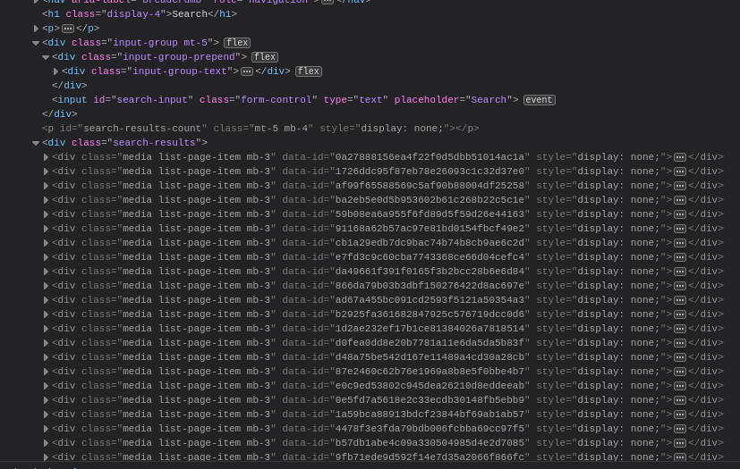

My website is built with [Hugo](https://gohugo.io), a great static site generator with a bunch of features. One of the big missing features though is search. Hugo has [documentation](https://gohugo.io/tools/search/) on a bunch of different integrations, but none of them quite did what I wanted. Over the last few months, I've been ["badgered"](https://twitter.com/ironicBadger/) to add search to my site, to make content easier to find when trying to find something I've written about (I do write quite a lot). A few weeks ago, I did exactly that. Hugo's own search uses [Algolia](https://www.algolia.com/), which is great, but not being self-hosted meant it was out for obvious reasons. So instead, I wrote my own.

## How it works

For "normal" sites which need search, [ElasticSearch](https://www.elastic.co/elasticsearch/) is basically the go-to engine. It's fast, powerful, and smart enough to know what you want even if you don't explain yourself properly. However, for a site the scale of mine, it's a _little_ overkill, not to mention the fact it'd require an extra server to run to handle search requests, and I'd need to somehow update its index when I deploy changes.

Instead, there are client-side searches - The most popular of which is [`lunr.js`](https://lunrjs.com/). Rather than requiring a separate server, lunr builds a search index in memory, and searches off that using pure javascript. That means it's nowhere near as powerful as ElasticSearch, but it's still pretty damn fast! There is [`elasticlunr`](http://elasticlunr.com/), which as the name suggests, is a more powerful version, but it's been updated in a while, and is heavier. For my needs, lunr works perfectly.

### Search index

One of the reasons I didn't use any of the tools Hugo documents is because they build the index at build time, and download that to the client. The issue with that is that search indexes are quite large, meaning there's a lot of data to download before anything can happen. Search indexes are the reason search engines work so well, by denormalizing the content, it's easier and faster to find which items contain certain words or terms.

Instead, I decided to serialize the data I need into a custom JSON file and serve that to the user instead. This way, it contains just the data I need, and is often less than 20% the size of a full search index. The index is around 500k at the moment, and that's before gzip. My "index" (which isn't really an index) contains just the title, plain content, and a unique id (which will make sense later).

```go-html-template
{{- $result := slice -}}

{{- range (where .Site.RegularPages "Section" "!=" "") -}}
    {{- $data := dict "title" .Title "content" .Plain "id" .File.UniqueID -}}
    {{- $result = $result | append $data -}}
{{- end -}}

{{ jsonify $result }}
```

The index is built using an alternative format for the search page, so it's built during the regular Hugo build process - nothing else needed. That means no matter what, the index is up-to-date when content changes.

### Fetching the index

With the "server" side all done, the data needs to get to the client. Because I'm a terrible, lazy person, who already uses jQuery, I used [`$.getJSON`](https://api.jquery.com/jquery.getJSON/) to fetch my previously generated "index". Once loaded, I turn my index into an actual index for lunr to get to work on.

Whilst the data is being downloaded and index generated, being able to search doesn't make much sense. For that reason, the search input is disabled until everything is ready to go.

### Searching

Once the index is built, and the input enabled, it's time to search. There's a small event handler on the input which searches whenever the user enters text. For the sake of performance and ease, it won't search until 3 characters are entered, else the results are rather useless.

The searching itself is done entirely in lunr, simply returning the matched results in order of relevance. Because the searching itself is so fast, and only occurs on the client, there's no throttling, so results are shown almost immediately.

```javascript
// do search
const results = searchIndex.search(term).map(match => match.ref);
```

In addition to a search input, the search query may come from the querystring. On my homepage, there's another search input which, on submit, redirects the user to the main search page, passing the search query as it goes. Just after the index is built, the querystring is checked, and if one exists, the search input is populated and a search performed.

### Showing results

Knowing which pages match the search is 1 thing, time to show it. In past projects, I may have done this using something more intelligent like react, but I intentionally wanted this to be as simple as possible. I also already had a list design I liked on every other list page, and didn't really want to duplicate anything if I didn't have to.

Hidden in the page's content is actually all possible page results, with `display: none` to hide them. Each item has a data attribute on with the unique id of the relevant page. This way there's 100% code reuse with a normal list page.



Lunr returns a bunch of metadata about the match. The only things I need are the "ref" (the id of the matched item) and the "score". Then, for each possible result on the page, if it was returned from lunr, show it, else hide it. Once the results have been displayed or hidden, they're sorted by relevance. There's no virtual DOM or anything, but the few DOM updates which are necessary are still pretty fast.

The [client code](https://github.com/RealOrangeOne/theorangeone.net/blob/master/static/src/js/search.js) is nice and short and easy to follow.

## Does it work?

Personally, I'm really happy with it. The initial page load takes an almost imperceivable amount of time to set up everything, and from there search results are basically instant, all with little to no increase in server load or site build time.

[Does it work for you?]()


