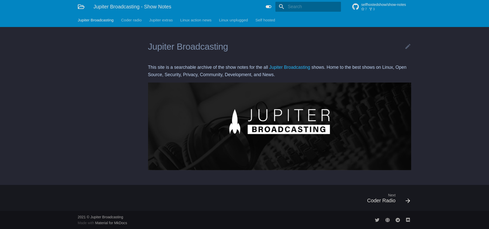

It was a normal (for 2021) Sunday evening back in July, I was minding my own business, obviously doing something _super cool_, when I spotted a [message](https://discord.com/channels/693469700109369394/693469700109369397/866362106089177089) from a certain [badger-y fellow](https://twitter.com/IronicBadger/) in the [Self Hosted show](https://selfhosted.show/)'s [Discord](https://discord.gg/U3Gvr54VRp):

Alex has the lovely and weird ability of reliably [nerd-sniping](https://xkcd.com/356/) me into spending a couple of hours or so creating a side projects, so down the rabbit-hole I dove...

## The project

The task was simple: Make show notes searchable so listeners of any Jupiter Broadcasting show could find links to things mentioned in previous shows easier, or listen back to hear more. For obvious reasons that required pretty great search, and automatic updates for when new episodes are released, which is [quite often](https://feed.jupiter.zone/allshows).

And so, after an evening of hacking, [notes.jupiterbroadcasting.com](https://notes.jupiterbroadcasting.com) was born!



## How it works

The site itself is based on [mkdocs](https://www.mkdocs.org/), a static site generator specifically designed for documentation (as the name suggests). On top of this, the absolutely fantastic [mkdocs-material](https://squidfunk.github.io/mkdocs-material/) theme provides the much more modern (material) interface and most importantly improved search UI with autocomplete!

### Fetching data

Jupiter Broadcasting use [Fireside](https://fireside.fm/) for hosting the show notes and audio files. Your podcast player of choice (mine is [PocketCasts](https://www.pocketcasts.com/)) reaches out to Fireside to download the RSS feed and episode audio for playback. Fireside doesn't have a public API, instead having a "JSON feed" ([not](https://github.com/firesidelabs/fireside-features/issues/11) the same thing!), which exposes show information perfect for consuming.

However, as anyone else who has worked with 3rd-party APIs will know, no API is ever perfect. It's just 1 endpoint, which lists everything you can have, and if there's something else you need - tough. Fireside's feed is far from complete, and there are 2 major omissions: tags and hosts. And so, it's scraping time!

As usual, when it comes to HTML scraping, the wonderful [BeautifulSoup](https://pypi.org/project/beautifulsoup4/) came to the rescue. When I arrived, Alex had already spotted that the JSON API sucked, and had already started down the scraping avenue, however had tried to do everything through scraping instead. Because scraping is notoriously brittle, that's not a good idea, so instead as much as possible is pulled from the JSON feed, and augmented with scraping only in the 2 places it's absolutely necessary. [The script](https://github.com/selfhostedshow/show-notes/blob/main/scrape.py) uses the JSON feed to list all the episodes, then each one is processed to get the required context for future use. During that, an additional request is made to get the show page itself, parsed with BeautifulSoup, and the tags and hosts extracted with some hard-coded CSS targets.

#### Parallelism

All this scraping and parsing is still reasonably fast, but there's a fair amount of data. Chris and the rest of the JB crew are pretty active, and even with just the 5 currently active shows there are over 1100 episodes. The parsing code and constructing the template context was pretty fast - the bottleneck is waiting for the request to Fireside for the episode. There's 1 request per show to list the episodes, and 1 per episode to grab its specific page to scrape - that's a lot of requests. Originally, I ran these all sequentially, because it's simple that way, but it was rather slow, taking almost a minute.

But this is 2021 (just), we don't have single-core machines any more, let's throw some parallelism at this! Python has a great tool in the standard library called [`concurrent.futures`](https://docs.python.org/3/library/concurrent.futures.html), which is a simple API around running a number of independent tasks in parallel. The [`ThreadPoolExecutor`](https://docs.python.org/3/library/concurrent.futures.html#threadpoolexecutor) runs the tasks in threads, and automatically handles running the right number of threads, and scheduling if there are more tasks than threads. There's also a [`ProcessPoolExecutor`](https://docs.python.org/3/library/concurrent.futures.html#processpoolexecutor), but processes are heavier, and we don't need the benefit of dedicated processes. Because creating each page is pure, and doesn't depend on any other, it's easy to just queue them up into the pool and wait.


Yes, Python's [Global Interpreter Lock](https://wiki.python.org/moin/GlobalInterpreterLock) does mean threads isn't perfectly parallel, but given the Python side of it is pretty fast, and the GIL is unlocked whilst waiting for network IO, it doesn't _really_ matter.


In a [single commit](https://github.com/selfhostedshow/show-notes/commit/2b5196e2fa8d3db1b1beac46c30a869cdd8b7e88), the execution time dropped by an order of magnitude, down to a lovely 4 seconds. Testing small changes in the latter stages suddenly got a lot faster. The fireside site also doesn't seem to rate limit, so throwing 12 concurrent requests at it as fast as possible appeared to be no problem.

### Rendering content

For mkdocs, each page starts life as a markdown file. At render time, this markdown is converted into HTML along with any other templating needed, and the layout of the files is used to populate the navigation tree.

With the context for each page from above, it is templated into a [markdown file](https://github.com/selfhostedshow/show-notes/blob/main/templates/episode.md.j2) using [jinja](https://jinja.palletsprojects.com), a Python templating engine. Various pieces of episode information such as title, sponsors, links, tags, even an embedded player are all inserted into a file. This file is then saved based on the show name and release year into the `docs` directory, ready to be picked up by mkdocs. From here, the site is just another mkdocs site. `docs` contains a bunch of markdown files with content, which mkdocs is very good at turning into a site, and so it does. All other features such as the dev server and live reloading all work as expected, especially constructing the search index.

mkdocs is _fairly_ fast, building even a reasonable-sized docs site in a few seconds, but 1100 pages is a **lot** of content. Even on my machine, mkdocs takes a while to generate - almost a minute. It appears that, unlike my scraping, mkdocs renders its pages sequentially.

### Show branding


Each show has its own colour palette, as every good brand should. But, having the notes site be the default blue felt a bit boring. If only there were a way to colour each show's part of the site based on its branding...

Well, there wasn't, but with a bit of a bodge, there is now.

When the page loads, there's an additional piece of javascript which runs and works out the page currently being viewed. Each show is a top-level section in mkdocs, which means it's possible to get the show name by taking the first bit of the URL:

```js
// https://notes.jupiterbroadcasting.com/self-hosted/2021/episode-042/
location.pathname.split("/")[1];  // "self-hosted"
```

This "show slug" is then added as a data attribute to the HTML `body` tag, which is targetted with some custom CSS styles to override some of the variables which mkdocs-material uses with the branding of the relevant show. It's possible to achieve a similar thing by overriding the existing theme mechanics, but using custom CSS and hex codes was much more fun!

```css
[data-show="self-hosted"] {
  --md-primary-fg-color: #eb6f23;
  --md-primary-fg-color--light: #eb6f23;
  --md-primary-fg-color--dark: #eb6f23;

  --md-accent-fg-color: #f3a922;
  --md-accent-bg-color: #f3a922;
}
```

### Hosting

So, we have the show notes in a fancy website form - but how do other people see it?

It's no secret that everyone at Jupiter Broadcasting is pretty partial to [Linode](https://linode.com/ssh), and that's exactly where the site is hosted. Running on a small VPS is a bog-standard nginx docker container serving the site from the filesystem, sat behind my beloved [Traefik](). And of course, the whole thing is provisioned with a mixture of [ansible and terraform](https://github.com/selfhostedshow/infra).

There are [several different]() ways of deploying a static website, but this is how we did it. Every day at 11am, a [scheduled GitHub action](https://github.com/selfhostedshow/show-notes/blob/main/.github/workflows/scrape.yml) is kicked off. This task does 2 things:

First, it runs the scrape. Pulling the data from Fireside as mentioned [before](#fetching-data) and generating the markdown files. Once I got the project working, Alex made a change which commits all the markdown files into the repo ["for posterity"](https://github.com/selfhostedshow/show-notes/commit/3dd595039417560fee72c133b70b50fbd9a3bbf5). This makes deploying the site much easier, at the cost of working on it much more of a pain, not to mention committing build artefacts is basically a sin. Once the scrape is finished and there are new markdown files, they're committed to the repo.

Once the scrape and commit has finished, the deployment itself begins. For this, the repository is simply `git pull`ed onto the server, and a `mkdocs build` issued using the `mkdocs-material`docker container. This built site is output to the filesystem, such that it can be picked up by the nginx container, and served out to the world.

## Where is it now?

As I mentioned before, the site has been up and running like a champ for the last 6 months, and by the looks of it people are definitely making use of it. If you're trying to remember which episode something was mentioned in, or quickly jump to the show notes of a specific episode, it makes life significantly simpler.

The [repository](https://github.com/selfhostedshow/show-notes/) itself doesn't get much activity, besides the automated update commits, but that's ok. It's feature-complete, and because I wrote it has no bugs of any kind ([honest](https://github.com/selfhostedshow/show-notes/commit/30e90ce759e8bcba7bd09a4e5a6c252b05e5abf3)...).

Want to give it a look for yourself? I highly recommend checking out [this episode](https://notes.jupiterbroadcasting.com/self-hosted/2021/episode-042/), for totally unbiased reasons.
