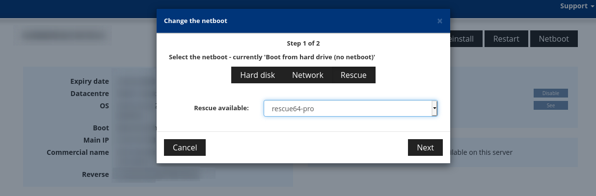

Recently, I bought myself a new server from [Kimsufi](https://kimsufi.com/), to function as an off-site backup server. And after fighting with both their management interface and customer services, I finally got it booted. Kimsufi have a respectable list of OS options, however not especially recent. The latest version of Ubuntu they have is 16.04, and the Arch installer is based on an image from 2018.

[OVH](https://www.ovh.co.uk/), the parent company of Kimsufi, have been known to [backdoor](https://news.ycombinator.com/item?id=4839414) their dedicated servers. Whether this is for monitoring or not, I don't really like it. I did know about this before purchasing, and thought it'd be a fun idea to try to install arch myself, from scratch. I found a [great tutorial](https://joel.porquet.org/wiki/hacking/archlinux_kimsufi/) on how to do it, and whilst it worked mostly, it did seem a little out of date, hence this post.

## Installation

The below is a mixture of some specific instructions on installing on Kimsufi servers, and generic arch installation instructions. If you're not installing on Kimsufi (or some other dedicated server host I guess), you're in the wrong place!

### Boot into recovery

The first step is to boot into recovery by clicking "Netboot", then "Rescue" and select "rescue-pro" in the menu. Be sure to restart (this may happen automatically). After some time (a few minutes, it's longer than you'd think), the machine will be back online, and you'll receive an email with authentication instructions. If you've got an SSH key configured, that'll be configured too.



### Partition

Naturally, you'll need to partition your installation disk. `lsblk` will help you work out which disk you need to target in your partition tool of choice. There's nothing really special about this step, although you'll need to make sure you can mount it. For me, I went with a tiny FAT32 `/boot`, 100GB XFS on root, and the rest left unformatted, to be filled by ZFS once I'm installed.

Once your disk is partitioned, mount it under `/mnt` (and `/mnt/boot`).

### Bootstrap arch

At this point in a regular arch install, you'd start running `pacstrap` to install arch. On the Debian-based recovery environment, that doesn't exist. Instead, we use [`arch-bootstrap`](https://github.com/tokland/arch-bootstrap).  Unfortunately, using this script as-is has a couple issues, all revolving around `zstd`.

Back in January, [Arch migrated](https://www.archlinux.org/news/now-using-zstandard-instead-of-xz-for-package-compression/) from `xz` to `zstd` for its packages. Unfortunately, this requires both changes to `arch-bootstrap`, and installation of `zstd` to ensure they can be decompressed. `arch-bootstrap` doesn't support this yet, so [a fork](https://github.com/stvhay/arch-bootstrap) has to be used, which does.

#### Installing `zstd` in the recovery environment

At time of writing, the recovery environment is based off Debian Jessie. Unfortunately, the Debian [backports](https://backports.debian.org/Packages/) don't go back that far, so a normal installation isn't quite an option.

In hindsight, cloning and [compiling from source](https://github.com/facebook/zstd#build-instructions) would probably have made quite a bit of sense, but in my sleep-deprived state, I decided to try something far, far worse... Don't try this at home!


I downloaded the [`zstd` package](https://www.archlinux.org/packages/core/x86_64/zstd/) from the Arch repository onto my local machine, extracted it and zipped it, and transferred it up to the server. From there, it could be extracted from the zip, and the files copied into the relevant places under `/usr`.

For me this didn't work entirely correctly due to linking issues. Fixing that was done by downloading the Debian Stretch `zstd` package, and manually installing it with `dpkg`. The installation failed, but for some reason after this `zstd` could be run correctly.


With `zstd` installed, we can run `arch-bootstrap` to create our template Arch environment. It can be run with `./arch-bootstrap.sh /mnt`.

### Enter your install

The arch installer contains the handy `arch-chroot` script, which handles creating and entering the new installation. In the recovery environment, we have to do that manually:

```
mount --bind /proc /mnt/proc
mount --bind /sys /mnt/sys
mount --bind /dev /mnt/dev
mount --bind /dev/pts /mnt/dev/pts

chroot /mnt bash
```

### Setup keyring

`arch-bootstrap` manually installs packages, rather than using `pacman`, which means there's no keyring configured for future use. Before you can install packages using `pacman`, you'll need to initialize the keyring:

```
# pacman-key --init
# pacman-key --populate
```

### Install base packages

Now back to more familiar parts of the installation process: Installing the base packages. Where normally this would be done with `pacstrap`, now they can be done with regular `pacman`. There's nothing special about this bit - I generally install `base base-devel linux vim`.

### Polish installation

The next step is pretty familiar to those who have installed Arch before. You'll need to set up things like locale, create the initramfs, install grub (or other boot manager) etc. Again nothing special here, just make sure to do it.

If there's anything else you want to install or set up pre-installation, now is the time.

### Networking

Personally, I find all the different networking set-ups rather strange, and lots of different people have different ways to set it up, manually or otherwise. I just install and enable `dhcpcd`, and it just works and has never let me down so far! The original guide mentioned issues with interface naming, but again never hit any signs of that being an issue.

### Finalize installation

Before rebooting, you'll need to install `openssh` so you can reconnect to your new arch installation, and create users to authenticate as. You won't be able to login as root (which is a good thing!), so you'll need to make yourself a user, and make sure you can become root via `sudo` (`visudo` will let you set that up).

## Reboot

In theory, you're done! You've got a functioning arch system you can boot into. Now simply exit the `chroot` environment (with `exit`), and reboot (with `reboot`). Be sure to check that the boot media is set up to be the installed HDD over the rescue ISO.

Give it a couple of minutes (in my case it was near 10!) and you'll be able to SSH into your new arch server, and do with it what you will. Mine's serving the very site you're reading!
