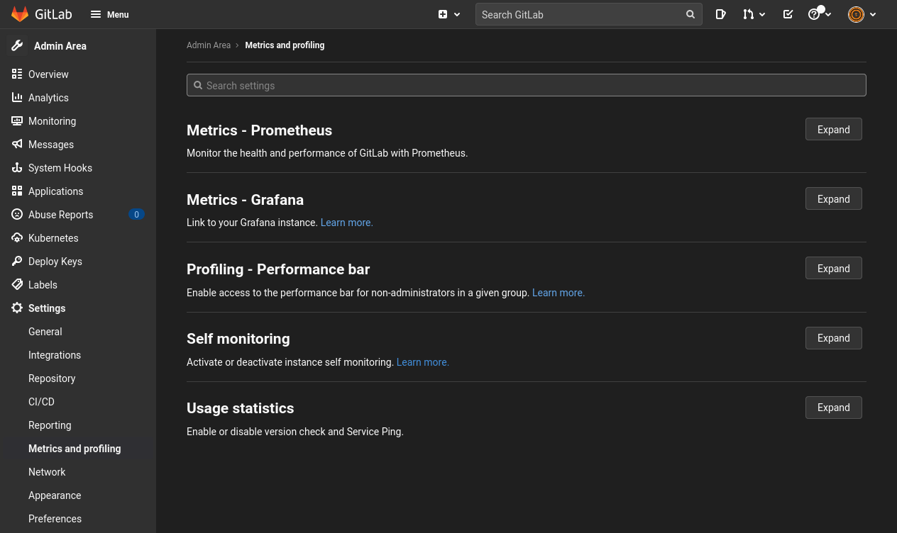
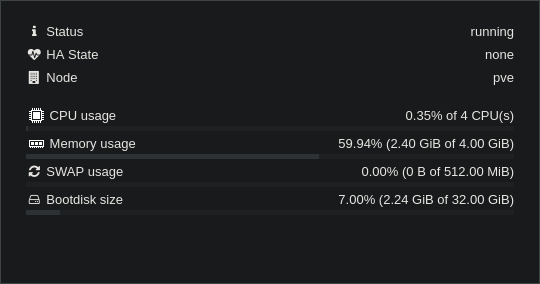

It's no secret that [GitLab](https://about.gitlab.com) is a beast of an application. As self-hosted git servers go, it's easily the most powerful and feature complete. But that weight comes at a cost: resource usage. GitLab is no slouch, easily consuming upwards of 6GB of RAM by default without doing anything, and that's even before you have a mountain of users trying to get their work done.

When you install GitLab, it's generally through the ["Omnibus"](https://docs.gitlab.com/omnibus/) package, which not only contains each and every component of GitLab, it contains them all enabled by default. If you're running GitLab for your business, that's probably fine, but last time I checked, I am not a business. I'm just a self-hoster wanting to host my Git repositories myself.

For most, GitLab is akin to using a sledgehammer to crack a walnut - A _little_ bit overkill. [Gitea](https://gitea.io/) on the other hand is a great project for those after a self-hosted git server, with both the features and UI they've grown accustom to from using GitHub. Another sell is that Gitea is significantly lighter than Gitlab, using little to no resources at all - a big selling point for casual users. However, I could never quite get on with Gitea's UI, not to mention I really wanted an amazingly well integrated CI/CD system, which lead me (after a few back-and-forths) to GitLab.

No amount of tuning is going to bring GitLab in line with Gitea when it comes to resource usage. GitLab is a huge codebase made up of lots of different applications, designed to run gigantic installations. Gitea can do that, but it's a long way off the feature set. The memory usage may also have something to do with GitLab being primarily a monolith Ruby on Rails application, whilst Gitea is a single Go binary, but I'll save my thoughts on different programming languages (particularly [Go](https://fasterthanli.me/articles/i-want-off-mr-golangs-wild-ride)) for some other time.

Whilst the omnibus package comes with everything enabled _by default_, it doesn't have to be this way. The omnibus package is [incredibly customizable](https://gitlab.com/gitlab-org/omnibus-gitlab/blob/master/files/gitlab-config-template/gitlab.rb.template), with the ability to tune and tweak things to your heart's content. [My server]() does have the 6GB RAM a default install needs, but disabling and tweaking a couple settings brings that down massively, to something at least more comfortable.

## External reverse proxy

Because the omnibus is designed to be self-contained, it ships with a full production-grade reverse proxy, in the form of nginx. Nginx is an incredible piece of software, but because I run other things on this server, I have a different reverse proxy in front of it ([Traefik]()). Therefore, having GitLab's nginx trying to do TLS termination, HTTPS redirect, all that good stuff, just isn't necessary - Traefik will happily do that for me.

Instead, all I want is for GitLab to listen on a single port and not do secure redirecting or anything else fancy. To help with this, GitLab has some native configuration to disable the things I don't need:

```ruby
# Stop redirecting HTTP to HTTPS
nginx['redirect_http_to_https'] = false

# Don't attempt to provision a TLS certificate
letsencrypt['enable'] = false

# Disable nginx's status endpoint
nginx['status'] = {
  'enable' => false
}
```

Notice what I haven't done is disable HTTPS outright. Instead, I've created a self-signed certificate and installed that. There's no real downside to this, and it means connection between Traefik and GitLab, which are on different LXC, communicate securely.

```ruby
nginx['ssl_certificate'] = "/etc/ssl/certs/ssl-cert-snakeoil.pem"
nginx['ssl_certificate_key'] = "/etc/ssl/private/ssl-cert-snakeoil.key"
```

In my original setup, I also disabled gzip, with the intention of configuring that all in 1 place inside Traefik. However, I backtracked that after remembering that it would also disable nginx's `gzip_static`, which removes the need to compress files on the fly at all, as GitLab ships its static files pre-compressed. I'd recommend leaving it on (which it is by default) to reap all the [compression benefits]().

## Scale down the application

This is where the big resource wins come in. GitLab itself is really a couple different applications working together (microservices-style), but the main one is a large monolith Ruby on Rails application served using [Puma](https://puma.io/). By default, Puma is scaled pretty high, meaning it'll cope absolutely fine with even a medium-sized business with no configuration changes. However, I'm just me - I don't need the application scaled as high as that. When scaling an application, it's done in 2 ways: Horizontally and vertically. Horizontal scaling involves running more things (servers, processes, threads etc), and vertical involves running more powerful servers. When I mention GitLab being _"scaled too high"_, it's specifically about horizontal scaling.

The way GitLab calculates how many workers to run is [interesting](https://docs.gitlab.com/ee/install/requirements.html#puma-settings), but on my quad-core 4GB RAM LXC container, it tries to run 4 processes. More worker processes allows GitLab to respond to more requests at once, improving responsiveness for large numbers of users. But this comes at a cost: Increased memory and CPU usage. Each process is its own small version of GitLab's application codebase running in memory, along with everything else Ruby needs to run - multiplied by 4.

Alongside worker processes, there are threads. Each thread is what actually does handles the traffic, meaning the true number of requests which can be processed at once is (threads &times; workers). However, a thread is very different from a process, particularly when it comes to performance: 1 worker with 3 threads won't perform as well as 3 workers with 1 thread. There are several reasons for this, from the way the OS handles threads to Ruby's [GIL](https://jonathan-wong.medium.com/what-is-global-interpreter-lock-in-relation-to-ruby-18d0f4f20e20), but it can't be worked around. However, threads have a much lower memory overhead than processes, meaning for constrained systems, threads really work to our advantage.

On [my server](https://git.theorangeone.net/), I run 2 workers, each with the default number of 4 threads. Reducing it further to 1 worker, and bumping the threads a bit to 8 does save about 15% memory usage, but for the extra piece of mind and possible performance gains if multiple people are browsing, I'll take the hit.

In addition to Puma, there's [Sidekiq](https://sidekiq.org/). Sidekiq processes the background jobs GitLab needs to run. Similarly to Puma processes, the concurrency here can be configured. However, instead of being granular with processes and threads, you specify the "concurrency", eg how many tasks can run at once - [sidekiq will always use threads](https://it-qa.com/how-does-sidekiq-concurrency-work/) (unless you [separate queues into their own processes](https://docs.gitlab.com/ee/administration/operations/extra_sidekiq_processes.html)).

```ruby
# Just 2 workers
puma['worker_processes'] = 2

# 10 jobs is still quite a lot
sidekiq['max_concurrency'] = 10
```

## External databases

Because GitLab's Omnibus package is designed to be completely "batteries included", it contains both a Redis and PostgreSQL database, which is one of the reasons the package is quite so large. Depending on your use case, this may not be desirable, especially you already have a Redis or PostgreSQL database. Fortunately it's just a single line each to stop them:

```ruby
postgresql['enable'] = false
redis['enable'] = false
```

Then, once disabled, just point GitLab to your existing [Redis](https://docs.gitlab.com/omnibus/settings/redis.html#using-an-alternate-local-redis-instance) and [PostgreSQL](https://docs.gitlab.com/omnibus/settings/database.html#using-a-non-packaged-postgresql-database-management-server)


I really wish GitLab's omnibus package would come in pieces, rather than a single giant 1GB `.deb` file. Not only would it make update significantly simpler, by only downloading the components which actually changed, but it would save me from downloading entire components I don't need. There's probably some good reason it's done this way, but there's also a reason packages can specify their dependencies.


GitLab's docker container is a non-standard monster of a container (it runs Chef for god's sake!), but if you do choose to run it, I strongly recommend using external databases this way, as it means the container itself is handling less, and it's much easier to maintain and backup. I previously ran the container, but since [moving to Proxmox](), run it in an LXC.

## Monitoring

If data doesn't exist in 3 places, it doesn't really exist. If an application isn't being monitored, does it really exist?

GitLab wants to exist, and so comes with a suite of monitoring tools built in. In additional to its own health checks and tests, the Omnibus package ships with a built-in [Grafana dashboard](https://docs.gitlab.com/omnibus/settings/grafana.html) and [Prometheus server](https://docs.gitlab.com/omnibus/settings/prometheus.html) to collect and display the wide variety of metrics collected. I already run my own instances of both Grafana and Prometheus, so I just don't need them:

```ruby
grafana['enable'] = false
prometheus_monitoring['enable'] = false
alertmanager['enable'] = false
```

In addition to the GitLab application exposing metrics for itself, the package also installs ["exporters"](https://prometheus.io/docs/instrumenting/exporters/) to expose metrics from the likes of PostgreSQL into the mix too. These exporters could be used to retrieve additional metrics from everything in GitLab, but with the intention of making GitLab as lightweight as possible, these just aren't necessary. Fortunately, they're disabled along with the above.

In addition to these exporters, the metric collection inside GitLab can be disabled too. This saves some, albeit few, precious resources and CPU cycles spent keeping track of metrics we don't need. These can be disabled under "Admin Area > Settings > Metrics and profiling":



## Review

If you've made it this far, and are thinking "Great, so now GitLab is as lightweight as Gitea!", you're wrong! As I mentioned before, GitLab is a much larger application than Gitea, designed to do so much more and scale so much higher. It's just not going to happen. However, after applying all these changes, I've cut my resource usage down to "basically 0" on the CPU, and just over 2.5GB RAM. 2.5GB sounds like a lot, but that does contain:

- GitLab itself
- PostgreSQL
- Redis (an **in-memory** cache, remember)
- The additional small applications GitLab uses behind the scenes ([Gitaly](https://gitlab.com/gitlab-org/gitaly), Sidekiq, [workhorse](https://gitlab.com/gitlab-org/gitlab/tree/master/workhorse) etc)

All that in 2.5GB doesn't feel _too_ bad to me. Is it great? Not by a long shot. But for my needs, I'll survive.

I do run GitLab's CI runner, but that's on a separate ~~machine~~ LXC.



If you're interested in reading a little more, you can take a look at [my full configuration](https://git.theorangeone.net/sys/infrastructure/-/blob/master/ansible/roles/gitlab/files/gitlab.rb). GitLab also have their own documentation on running in [memory-constrained environments](https://docs.gitlab.com/omnibus/settings/memory_constrained_envs.html), which I discovered around half-way through writing this article.
