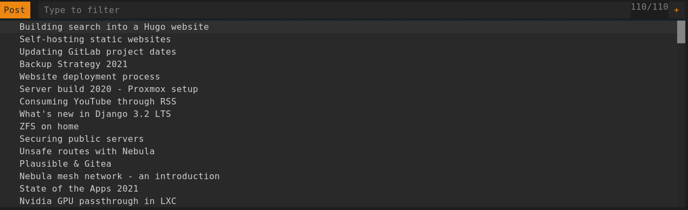
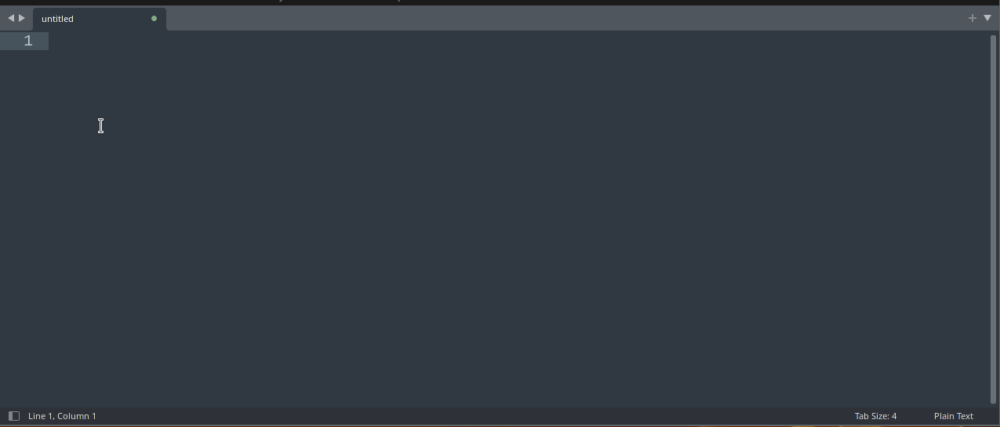

For anyone who's spoken to me, they'll know I'm very quick to link people to posts I've written. That's not in terms of pushing the things I've written (_usually_), but also being able to retrieve the links as quick as possible.

I [recently]() added [search]() search to my website, and it works great. But, as great as the search is for people to find which post talks about a certain thing, I already know which post talks about something, I wrote them! All I need is the link to send to someone.

I copied a trick I use for opening projects in my editor quickly, and wrote a script based on `rofi` to show the titles of posts, and on selection copy it to the clipboard.

## How does it work?

### 1. Source the data

My site is built with Hugo, which among other things is pretty extensible. Hugo lets you define multiple "output formats" for a page. Common uses for this is for RSS feeds for list pages, but it doesn't have to be. I've added a JSON file as an output format for the site index, which contains all the pages, and a few key pieces of data from them.

Because this file is downloaded by the script, it needs to be as small as possible, hence only the absolute required keys are present. The JSON is in its non-pretty format, and my server will gzip it in transit anyway. Because my site is static, the file is always up-to-date with the available content - no caching to deal with.

The URL for this is https://theorangeone.net/index.json.

### 2. Fetch the data

The first part of the script is to load the previously mentioned data from the server. The script itself is written in Python. Normally I'd use `requests`, but in an attempt to keep the script as dependency-less as possible, I've used `urllib`. The API isn't as nice, but it gets the job done in just as many lines (2). Once downloaded, the JSON parsed and converted into a simple mapping (`dict`) between the post title and its URL:

```json
{
    "Building search into a Hugo website": "https://theorangeone.net/posts/hugo-website-search/",
    "Self-hosting static websites": "https://theorangeone.net/posts/self-hosting-static-websites/"
    ...
}
```

### 3. Show `rofi`

With the data now loaded, it needs passing to `rofi`. Rofi takes each item to display from `stdin` newline-separated, which is what makes it so easy to script. In this case, each item is the post title.



Once a selection is made, rofi returns the selected title on `stdout`, which can be matched to the original mapping to find the desired URL to copy.

### 4. Copy to clipboard

With the URL in memory, it's time to get it out and onto the clipboard - no good it staying where it is.

For copying text to the clipboard, there are a number of great python libraries to do it. But again, requiring it be dependency-less means yet more fun. Fortunately, as I only needed it to work on linux, it doesn't need to be cross-platform.

`xsel` is a command line tool to modify the clipboard on linux. Pass it the URL, and it ends up on my clipboard. In much the same way I call out to rofi, `subprocess` is the tool I need. I've considered using something like `xdotool` to type it instead, but the clipboard is far more versatile.

## Demo

And now, I can grab links to posts I've written in record time!



And of course, you can [see the source](https://github.com/RealOrangeOne/dotfiles/blob/master/files/bin/website-link).
