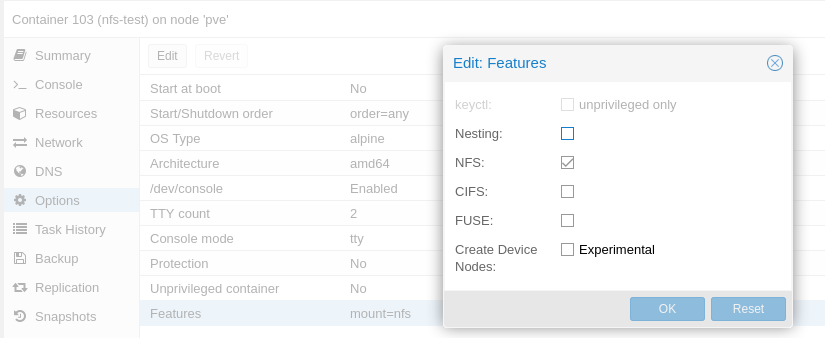

[NFS](https://wiki.archlinux.org/index.php/NFS) is a great protocol for sharing files quickly and simply over the network. Whilst it's not designed for end user use, it's great for mounting directories from remote machines, and having them be performant. NFS' lack of authentication is in a way a feature, honest. Not only does it remove the additional application and protocol overheads and complexities, but it also forces you to think properly. Either firewall it off, or run it over a VPN.

For my [latest server](), I intend to have the majority of my data storage handled by a [~~FreeNAS~~](https://www.ixsystems.com/blog/freenas-truenas-unification/) [TrueNAS](https://www.truenas.com/) VM which handles ZFS, and simply expose the data to each VM / LXC container through NFS. TrueNAS has built-in support for functioning as an NFS server, and a web UI to manage shares.

Unfortunately however, if you try and mount an NFS share from an LXC container, you'll receive some form of "Permission denied" error, even if you're `root`:

```
nfs-client:~# mount x.x.x.x:/mnt/test-pool/test /mnt/nfs
mount: permission denied (are you root?)
nfs-client:~# whoami
root
```

So, what gives?

## LXC Isolation

LXC is a container technology. Whilst it's similar to Docker, it's also incredibly different and fills a different need. For example, it's very common to run Docker inside an LXC container, but doing the inverse or attempting to run Docker inside docker (which [is possible](https://hub.docker.com/_/docker/)) may get you some weird looks.

LXCs isolation comes in part from [apparmor](https://www.apparmor.net/), and it's apparmor which is preventing LXC from mounting NFS shares. On Linux, NFS is implemented in the kernel. There are a few reasonably popular and maintained userspace implementations, such as [`unfs3`](https://github.com/unfs3/unfs3) and [`nfs-ganesha`](https://github.com/nfs-ganesha/nfs-ganesha), although they don't have [much traction](http://lkml.iu.edu/hypermail/linux/net/9611.3/0018.html) (and I couldn't make them work).

### What is "privileged" mode?

LXC has the concept of [privileged mode](https://pve.proxmox.com/wiki/Unprivileged_LXC_containers), which defaults to false. By default, the user IDs of LXC containers are different to those on the host. So processes running as `root` (id 0) in LXC won't be id 0 to the host. This provides an additional layer of security on the off chance an attacker is able to break out of the LXC container isolation, however unlikely that may be.

Anyone familiar with Docker will note that docker [doesn't work like this](https://docs.docker.com/engine/reference/run/#runtime-privilege-and-linux-capabilities): The id inside the container is the same as on the outside. This makes volume maps much easier to work with, but makes it more important to [not run docker processes as root]().

Personally, I think this isn't the best name for the setting. It implies more of LXCs security issues are removed than actually are. I still wouldn't recommend running privileged unless you absolutely have to, but it doesn't remove the isolation quite to the level Docker's `privileged: true` does.

## NFS Support

To support NFS under LXC, some of the apparmor protections need to be lifted. Looking online, there are a number of guides which claim to make the required modifications for [LXC to mount NFS](https://unix.stackexchange.com/questions/450308/how-to-allow-specific-proxmox-lxc-containers-to-mount-nfs-shares-on-the-network). I tried every single one, and nothing appeared to work correctly. That said I've not worked much with apparmor. They all hinged around creating a new profile for LXC, and forcing the container to use it. If you know the secret ingredient to make this work for unprivileged containers, please [tell me]()! There are however several ways to make it work for privileged containers, which like I say isn't the end of the world, and is needed for some of my use cases anyway.

## Mouting

One that's done, restart the container, and you should be able to mount your NFS shares as normal. To ensure they're mounted correctly on boot, configure your mounts in `/etc/fstab`:

```
192.168.1.1:/data   /mnt/data   nfs   defaults	0 0
```

Or the quick and dirty way using the command line:

```bash
$ mount -t nfs 192.168.1.1:/data /mnt/data
```

## TL;DR

How _do_ you mount NFS shares inside an LXC container?

1. Create a privileged LXC container, using any guest distribution of your choosing
2. Once created, modify the config file (`/etc/pve/lxc/<id>.conf` on Proxmox) and add `features: mount=nfs`
3. Restart the container
4. Mount your data (e.g. `mount -t nfs 192.168.1.1:/data /mnt/data`)


