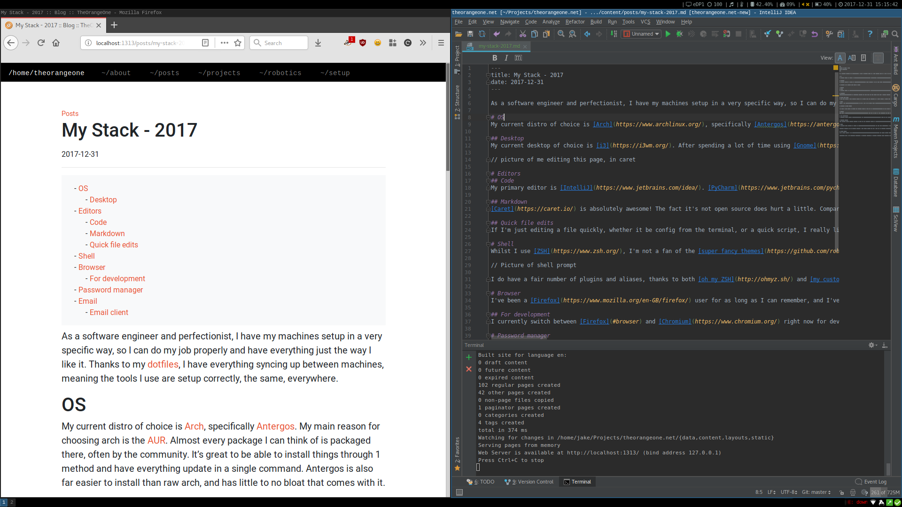
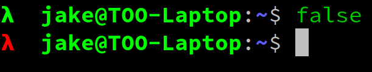

As a software engineer and perfectionist, I have my machines set up in a very specific way, so I can do my job properly and have everything just the way I like it. Thanks to my [dotfiles](), I have everything syncing up between machines, meaning the tools I use are configured correctly, the same, everywhere.

# OS
My current distro of choice is [Arch](https://www.archlinux.org/), specifically [Antergos](https://web.archive.org/web/20190903082315/https://antergos.com/). My main reason for choosing arch is the [AUR](https://aur.archlinux.org/). Almost every package I can think of is packaged there, often by the community. It's great to be able to install things through one method and have everything update in a single command. Antergos is also far easier to install than raw arch, and has little to no bloat that comes with it.

## Desktop
My current desktop of choice is [i3](https://i3wm.org/). After spending a lot of time using [Gnome](https://www.gnome.org/), and always having windows either full screen or split, I tried out i3 in an attempt to use fewer resources, and it's amazing. Admittedly i3 doesn't look quite as nice, but it's far cleaner, and structured, and that's enough for me!

# Editors
## Code
My primary editor is [IntelliJ](https://www.jetbrains.com/idea/). [PyCharm](https://www.jetbrains.com/pycharm/) would be a better fit, as I spend much of my time writing Python, but as I have a strong dislike of Jetbrains' approach of having [an editor per language](https://www.jetbrains.com/products.html), IntelliJ has the best support for all languages, in one editor. As an IDE, it has more features than I could ever need, and is more than fast enough for editing the large projects I work on. I have a fairly large number of plugins installed, and even more of the default ones disabled.

## Markdown
[Caret](https://caret.io/) is absolutely awesome! The fact it's not open source does hurt a little. Compared to [ghostwriter](https://wereturtle.github.io/ghostwriter/), which is both free and open source, it's got some far nicer features such as a command palette and true live reload. Version 4 is [coming soon](https://twitter.com/careteditor/status/943816379618250752), hopefully this brings yet more features, but I fear asking for it to be open-sourced is going too far!

## Quick file edits
If I'm just editing a file quickly, whether it be config from the terminal, or a quick script, I really like [Vim](http://www.vim.org/) for this. It's insanely fast and lightweight. I have a [custom `vimrc`](https://github.com/amix/vimrc) installed to change it to support more features than stock.

# Shell
Whilst I use [ZSH](https://www.zsh.org/), I'm not a fan of the [super fancy themes](https://github.com/robbyrussell/oh-my-zsh/wiki/External-themes) for it, which display your current git branch, node version, time, all that jazz. My terminal is a take on the default colourized Debian terminal, with a lambda symbol who's colour changes depending on the return code of the previous command.

I do have a fair number of plugins and aliases, thanks to both [oh my ZSH](http://ohmyz.sh/) and [my custom config](https://github.com/RealOrangeOne/dotfiles/tree/master/files/zshrc).

## Terminal Emulator
[Terminator](https://gnometerminator.blogspot.co.uk/p/introduction.html) is a really fast, simple terminal emulator, with features like pane splitting, resizing, and many colour customizations. I do plan to move over to [Alacritty](https://github.com/jwilm/alacritty) just as soon as it gets [scrollback support](https://github.com/jwilm/alacritty/pull/657), because it renders things a lot nicer, and uses far fewer resources. I'm also very partial to things written in rust!

# Browser
I've been a [Firefox](https://www.mozilla.org/en-GB/firefox/) user for as long as I can remember, and I've got no reason to stop now. In the recent [Quantum](https://blog.mozilla.org/blog/2017/11/14/introducing-firefox-quantum/) update, it's only got faster! I've seen some very promising things from [Vivaldi](https://vivaldi.com/), but it's missing some key features, and is a little too buggy for me to use full-time.

## For development
I currently switch between [Firefox](#browser) and [Chromium](https://www.chromium.org/) right now for development. Chromium's dev tools are quite a bit nicer than Firefox's, and I've had issues with some projects causing Firefox to spike my CPU and cause my system to crash.

# Password manager
I've switched around password managers _a lot_, but I'm currently settled on [KeePassXC](https://keepassxc.org/), a community fork of [KeePassX](https://www.keepassx.org/), which is a cross-platform fork of [KeePass](https://keepass.info/). When it comes to cross-platform password managers, there's very little out there that's also open-source. I can access password on both my linux machines, and [my phone](https://github.com/PhilippC/keepass2android), and my windows OS when I occasionally have to use it. The [browser integration](https://addons.mozilla.org/en-US/firefox/addon/keepasshttp-connector/) is also pretty nice too!

# Email
My personal email provider of choice is [Mailfence](https://mailfence.com/), for now. I've experimented a lot with both [FastMail]() and [ProtonMail](https://protonmail.com/) in the past. ProtonMail is great for security and privacy, but is lacking far too heavily in features. FastMail is the inverse, it's interface and feature-set are amazing, but their privacy / security policies aren't good enough for me.

Mailfence supports all the standard features a mail client should, and has a nice set of [security features](https://mailfence.com/en/secure-email.jsp).

## Email client
For an email client, I use [Thunderbird](https://www.mozilla.org/en-US/thunderbird/). For linux, there's nothing quite like it out there! [Nylas](https://www.nylas.com/nylas-mail/) looked promising, but the fact it stored all data in the cloud (no longer an issue), and was far too bulky for a simple email client. Nylas mail is no longer supported, but I keep a good eye on [nylas-mail-lives](https://github.com/nylas-mail-lives/nylas-mail), a community fork to keep it alive.

Thunderbird with a few additional extensions is amazingly powerful. My personal favourite being [Markdown Here](https://addons.mozilla.org/en-US/firefox/addon/markdown-here/), which converts markdown to email HTML ready for sending.
