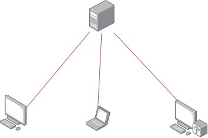
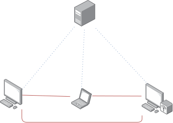

[WireGuard]() has been the "hot new thing" when it comes to VPNs, but it's not always the best suited for every workload. [Nebula](https://github.com/slackhq/nebula) is a mesh network originally created by Slack, but now owned by a [separate company](https://www.defined.net/).

- [TechSNAP 419 - Nebulous Networking](https://techsnap.systems/419)
- [Linux Unplugged 329 - Flat Network Truthers](https://linuxunplugged.com/329)

## What's a mesh network?

A conventional VPN, such as WireGuard and OpenVPN works in a hub-spoke pattern, such that all traffic flows through the central "hub", regardless of where the other devices are.




This is simple to maintain for small deployments, and is generally what you want when using a VPN to allow access to a private corporate network. This is also the model you want when thinking of commercial VPN solutions like [Mullvad](https://mullvad.net/) and [PIA](https://www.privateinternetaccess.com), where you don't want peers to connect to each other, just to route their traffic via the VPN server. This architecture doesn't work very well when nodes are trying to talk to each other, as traffic has to go via the host. Nodes could be single devices, or entire networks in themselves in a [site-to-site](https://www.paloaltonetworks.com/cyberpedia/what-is-a-site-to-site-vpn) deployment.

A mesh network is very similar to this, however rather than flowing through a single server, it flows directly from client to client without ever touching the server.



As you'll notice, there's still a central node. This is the "introducer", or "lighthouse" in Nebula's lingo, and it's responsible for ensuring all nodes on the network can communicate with each other effectively. The lighthouse is also the only node which requires a static IP. Because traffic is no longer routed via a single node, it drastically reduces the resource requirements for this node, along with reduces traffic bottlenecks. Traffic can take whatever paths it likes, simply being limited by the networks directly between it and the target device, which would be a bottleneck in any network setup. In some situations, this means traffic won't leave the LAN, and thus will run at full LAN speeds.

Nebula is constantly polling and updating the IPs usable for communications to a node, meaning devices can easily roam between networks and always be accessible through the same VPN IP. If the destination node is on the LAN, traffic will be sent through a LAN interface, if not it'll be sent over the internet, still directly to the device using [UDP hole punching](https://en.wikipedia.org/wiki/UDP_hole_punching).



### What about WireGuard

Everyone loves WireGuard, and for good reason! It's relatively simple, fast and built-in to the Linux kernel. Unfortunately however, it doesn't natively support meshing. It's possible to make WireGuard pretend it's a mesh, but it's not really designed for it. [`wg-dynamic`](https://git.zx2c4.com/wg-dynamic) is planning on changing that, but it's still under development (however inactive it may be).

There is [tailscale](https://tailscale.com/), which is a mesh VPN which uses WireGuard under the hood. If you really want to use WireGuard, that's the closest you're going to get. However, it's missing the firewalling features of Nebula, not to mention that the server component (introducer) isn't open-source.

## Getting started with nebula

Nebula is written in Go, and as such is available as a single binary. There are versions available for Windows, macOS and Linux. You'll be hard pushed to find it in any Linux distro's package repositories (besides [Arch](https://archlinux.org/packages/community/x86_64/nebula/), of course), so [downloading the binaries](https://github.com/slackhq/nebula/releases) directly is the easiest way to get started. On clients, you'll just need the `nebula`binary, but to provision the network, you'll also need `nebula-cert`.

Additionally, there are [mobile clients](https://medium.com/definednet/mobile-nebula-ios-android-mesh-vpn-1088a7c536ee). They're not feature-complete quite yet, nor are they fully polished, but they're definitely functional.

For my setup when writing this, I'll be running the lighthouse on an Ubuntu VPS, 1 client on my Arch desktop and 1 on my Android 10 phone.

### Keys

Nebula uses good ol' PKI for authentication in the form of Certificate Authorities (CAs). Clients are given the CAs public key, and their own public / private key pair signed by the CA. Because each client knows the CA, it can validate easily whether the client is authorized, and adding new clients doesn't require editing any config files.

The first step is to create the `ca.key`and `ca.crt`, which form your CA private and public keys. **Be sure to keep the `ca.key` file private**. I recommend storing the file offline, and treating it as you would an SSH private key to your servers.

```bash
nebula-cert ca -name "My Nebula Network"
```

Before locking it away, we need it to create some client certificates, 1 for each client. When generating a client certificate, you need have decided what subnet you'll be using for the VPN network. I'm going to use `10.10.10.0/24`.

```bash
nebula-cert sign -name "lighthouse" -ip "10.10.10.1/24"
```

This will create a `lighthouse.crt`and `lighthouse.key`, signed using your Nebula CA. These will then need to be **securely** transferred to your client. Repeat this process for each client you need to provision, except mobile devices - more on those later.


```bash
nebula-cert sign -name "desktop" -ip "10.10.10.2/24"
nebula-cert sign -name "laptop" -ip "10.10.10.3/24"
```

### Lighthouse

As mentioned before, the lighthouse client is used to establish a tunnel directly between clients to allow them to communicate.

When running, the nebula daemon uses very little resources. A few MB of RAM, and basically no CPU. Whatever device you have to run this, will run it just fine. The only requirement for a lighthouse is that it be reliable, and have a static IP.

#### Rootless lighthouse

By default, a lighthouse will also be accessible on the Nebula network as any other client, however it's possible to tell Nebula not to create a network interface. This means it won't be able to be communicated with over the nebula network, but means you can run your lighthouse without root.

### Configuration

Configuration for Nebula, like everything in the cloud, is done using a YAML file. The best way to get started is using the [example config](https://github.com/slackhq/nebula/blob/master/examples/config.yml). It won't work at all by default, so we need to make some changes to it.

The example configuration shows some great examples on what keys are and how you may want to use them. If you're going to deploy Nebula I recommend giving it a read in full. But these are the things you need to change to get a working tunnel:

#### Specify the keys

Under the `pki` key, specify the paths to the `ca.crt` along with the 2 keys created for the specific client.

```yaml
pki:
  ca: /etc/nebula/ca.crt
  cert: /etc/nebula/host.crt
  key: /etc/nebula/host.key
```

#### Static hosts

The static hosts define a list of nodes with a static IP for communication. This is mostly designed for specifying the lighthouse, but may also be useful for other nodes which will always have the same fixed IP.

```yml
static_host_map:
  "10.10.10.1": ["100.64.22.11:4242"]
```

As noted in the example config, this should be a mapping from the _VPN IP_ to the _public IP_ and port.

#### Lighthouse configuration

For a node to be a lighthouse, you have to tell it that it's a lighthouse using the `am_lighthouse` key. If the node is a lighthouse, make it `true`. If it's not, make it `false`.

```yml
lighthouse:
  am_lighthouse: false
```

Below that, you need to specify the _VPN IPs_ of all the lighthouses. If the node you're editing is a lighthouse, make sure hosts is empty. Yes, nebula supports multiple lighthouses!


```yml
lighthouse:
  hosts:
    - "10.10.10.1"
```

#### Listen

By default, Nebula listens on port 4242 (UDP) for lighthouse traffic. For your lighthouse, this should be set to something static, and kept in sync with the static hosts of clients. For nodes which aren't fixed, such as regular client devices, it's recommend to set this to 0, so nebula assigns a random port on startup.

```yml
listen:
  host: 0.0.0.0
  port: 0
```

#### Firewall

Nebula isn't just a tunnel, it also has some firewalling built in. Nebula nodes can be added to groups, and these groups can have certain access to ports on nodes. For example, you may want to only allow servers in the "db" group to allow traffic on port 5432, or only allow nodes in the group "web" to send traffic on ports 443, 80 and 5432. The example config [shows](https://github.com/slackhq/nebula/blob/master/examples/config.yml#L213) how to configure these as needed.

For testing, I'd recommend just allowing all traffic to all devices. If you want to tighten things down after you've got everything working, then it's best to do that afterwards.

```yml
firewall:
  outbound:
    - port: any
      proto: any
      host: any

  inbound:
    - port: any
      proto: any
      host: any
```


### Mobile setup

As mentioned previously, there is a mobile app for connecting to a Nebula network. It's still in beta, but it's available in the relevant app stores. Unfortunately, configuring it is a little more difficult.

The mobile app doesn't support being given an arbitrary private key for use. Instead, you generate a keypair on the device, and copy the public component of that to be signed by the CA.

```bash
nebula-cert sign -name "mobile" -ip "10.10.10.3/24" -in-pub ./public.key
```

Configuration isn't done using a YAML file, it's done using the controls on the mobile app. All the steps should be the same as above, just look slightly different. It's possible to view what the YAML would look like under "Advanced > View rendered config", which may be useful to see what the controls are editing.

If you're already using a VPN, this may not play especially well with it. If you're seeing issues, try disabling it.

### Starting the tunnel

With the keys and configuration in place, it's time to start the Nebula network! The command is the same whether you're starting a lighthouse, or regular client.

```
sudo nebula -config /etc/nebula/config.yml
```

This will start the nebula tunnel as configured in `/etc/nebula/config.yml`. Once started on all required machines, they should communicate and establish a tunnel. If a client dies, nebula will notice and close the tunnel, and traffic from other nodes will bounce. If the lighthouse goes down, clients will wait for the lighthouse to appear again, and resume connections.

## Testing

And now, the fun part: Checking everything worked correctly!

With every client started, every client will be able to ping every other client using its VPN IP, and have it run over the tunnel. This means you've now set up a VPN, and clients can have fixed IPs to communicate with each other, regardless of the network they're on.

```
$ ping 10.10.10.1 -c 3
PING 10.10.10.1 (10.10.10.1) 56(84) bytes of data.
64 bytes from 10.10.10.1: icmp_seq=1 ttl=53 time=9.69 ms
64 bytes from 10.10.10.1: icmp_seq=2 ttl=53 time=10.2 ms
64 bytes from 10.10.10.1: icmp_seq=3 ttl=53 time=10.6 ms

--- 10.10.10.1 ping statistics ---
3 packets transmitted, 3 received, 0% packet loss, time 2003ms
rtt min/avg/max/mdev = 9.692/10.139/10.565/0.356 ms
```

But that's the same as if this were using WireGuard. Where's the Nebula magic?

When doing pings, check the ping times. Pings to the lighthouse should be about what you'd expect for pings to a cloud server, but pings between the 2 clients should be significantly lower, because traffic is staying on the LAN.

```
$ ping 10.10.10.3 -c 3
PING 10.10.10.3 (10.10.10.3) 56(84) bytes of data.
64 bytes from 10.10.10.3: icmp_seq=1 ttl=64 time=0.274 ms
64 bytes from 10.10.10.3: icmp_seq=2 ttl=64 time=0.379 ms
64 bytes from 10.10.10.3: icmp_seq=3 ttl=64 time=0.255 ms

--- 10.10.10.3 ping statistics ---
3 packets transmitted, 3 received, 0% packet loss, time 2037ms
rtt min/avg/max/mdev = 0.255/0.302/0.379/0.054 ms
```

When doing the first connection between nodes, you may notice some latency before the first packet comes back. Nebula is lazy about creating tunnels between devices, and only creates them as needed. Packets are not dropped during this, and are instead buffered, so it shouldn't make a difference, just something to keep an eye out for as something known rather than a bug.

### Performance

Nebula is still pretty fast, and for regular use you'll be hard pushed to notice any issues. However, the default settings aren't tuned perfectly for performance. In my testing, I topped out at around 700MB symmetrical over a gigabit link. Now that's nothing to turn your nose up at, but there's definitely room for improvement. WireGuard sets the bar for what performance can be like for a VPN.

This performance issue **isn't** an issue with Nebula. Speaking with one of the original developers of Nebula, Slack have seen Nebula networks fully saturate 5 / 10 gigabit links without sweat. I was given some suggestions for how to boost the performance:

1. Increase the [read/write buffer](https://github.com/slackhq/nebula/blob/master/examples/config.yml#L86-L87) sizes to 20000000 (20MB)
2. Increase the [transmit queue](https://github.com/slackhq/nebula/blob/master/examples/config.yml#L136) length to 5000
3. Increase the [MTU](https://github.com/slackhq/nebula/blob/master/examples/config.yml#L138)

With these applied, I was topping out much nearer to 900MB. The default are rather intentionally conservative, but if you know what you're doing and have the time to tweak, it's possible to get some great performance. I'm still holding out hope that the defaults change to something slightly less conservative in the future.

## Application

It's all well and good singing the praises of Nebula, and it's a great tool to know for solving certain situations, but it's not globally useful everywhere. As far as more user-facing VPN servers, don't expect companies like Mullvad and PIA to start offering Nebula-based VPNs. Nebula isn't just a non-optimal technology for this, it's the wrong technology. In these cases meshing isn't useful, and may actually be a hindrance, so sticking to technologies like OpenVPN and WireGuard is a much better decision.

So, when should you use Nebula? Or more specifically, when am I going to use Nebula? Currently, I have a WireGuard VPN deployed to a Vultr VPS which serves 2 functions:

1. Access to non-public ports / devices
2. [Tunnel traffic between the VPS and my home server to route traffic to internally hosted applications]()

For the latter use, I won't be changing from WireGuard. Whilst I could use Nebula, I don't have any benefits in that use for a mesh, as there will only ever be 2 nodes. WireGuard has been working great for this use, and I don't really see a reason or a need to switch.

For the former, however, Nebula fits really well. In the interest of security, I have some services only listening on a VPN interface. For remote servers, this means I have to be on the VPN network to SSH in. For home devices, I can just use the local IP address, unless I'm out the house that is. Currently, I have to use a different IP or SSH alias to access home services depending on whether I'm at home or not, which is quite a hack. The alternative is that traffic flows from my desktop to my server via a VPS in London, even though the 2 devices are on a gigabit LAN - what a waste!

The meshing nature of Nebula means that when I'm at home, traffic flows purely on my LAN, and when I'm not, it flows direct, rather than via the server. That means I can still connect to services hosted in my house easily, but when I'm at home they run superfast! In an ideal world I'd route everything via Traefik, and just use IP whitelists to restrict access to certain web services, rather than use ports on VPN IPs. Unfortunately, whilst WireGuard supports overriding DNS, Nebula [does not](https://github.com/slackhq/nebula/issues/318).


graph TD

N[Nebula Lighthouse]

S1[Server 1]
S2[Server 2]
L[Laptop]

subgraph Home Network
D[Desktop]
H[Server]
end


N-.-S1
N-.-S2
N-.-D
N-.-H
N-.-L

D---S1
D---S2
D---H
L---H
L---S1
L---S2
D---L

S2===H


Once deployed, I'll just have a single 2-peer WireGuard tunnel, and everything else going over Nebula!
