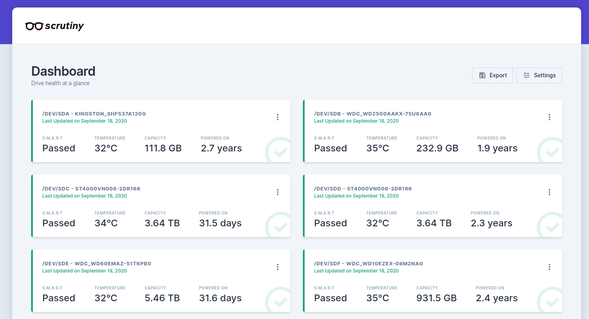
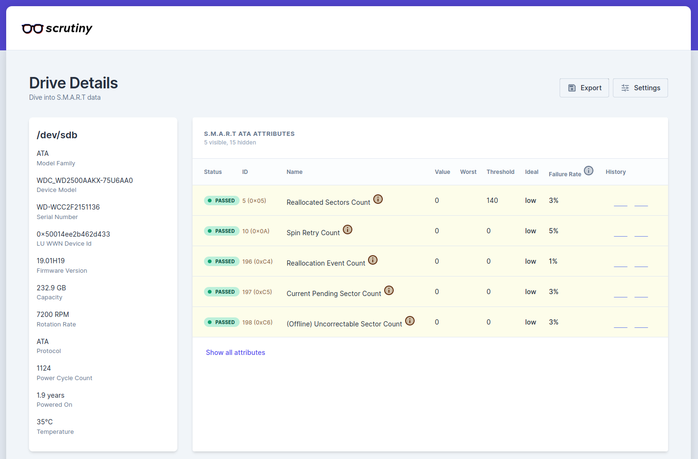

After recently deploying a ZFS pool, I realized I had little insight into the health of my drives. I can run SMART stats now and then, but that's not quite the same.

## Scrutiny

[Scrutiny](https://github.com/AnalogJ/scrutiny) is a tool to help you with just that. It presents a web UI which shows you statistics on your drives, based on SMART reports, and reports their health.

When [originally announced](https://www.reddit.com/r/selfhosted/comments/icreui/scrutiny_hard_drive_smart_monitoring_historical/), you could only get access if you [supported the author](https://github.com/sponsors/AnalogJ/), however now enough people have supported, the project is completely free and open source. Can't say I'm personally a huge fan of this model, but people who make great software should be rewarded, and I think Scrutiny is **great** software!

## Deploying

Scrutiny is written in Go meaning, if you so wish, you can deploy it by downloading a single binary, and running that. I however, prefer deploying things as docker containers. Fortunately, there's both an [official one](https://hub.docker.com/r/analogj/scrutiny), and [one provided by the LinuxServer.io folks](https://hub.docker.com/r/linuxserver/scrutiny).

Scrutiny is split into 2 components: the web UI and the collector. Currently, the collector requires that the container be run `--privileged`, so it can run SMART reports correctly. This can pose security issues, as it defeats many of the isolations Docker puts in place for you. Instead, both containers support running just 1 of the entry points, meaning the collector can be run privileged, but not the web UI, massively decreasing the attack surface.

```yaml
version: "2.3"

services:
  web:
    image: linuxserver/scrutiny:latest
    ports:
      - "7278:8080"
    volumes:
      - ./config:/config
    environment:
      - SCRUTINY_WEB=true
      - PUID=3000
      - PGID=3000
    restart: unless-stopped

  collector:
    image: linuxserver/scrutiny:latest
    privileged: true
    volumes:
      - /dev/disk:/dev/disk
      - /run/udev:/run/udev:ro
      - ./config:/config
    environment:
      - SCRUTINY_COLLECTOR=true
      - SCRUTINY_API_ENDPOINT=http://web:8080
      - PUID=3000
      - PGID=3000
    restart: unless-stopped
```

## Usage

When you first load up the Scrutiny UI, you'll be met with a message that there's no data. This is normal. Because Scrutiny only collects data each day at midnight, you'll need to run the initial import yourself:

```
docker-compose exec collector scrutiny-collector-metrics run
```

This will collect metrics for your drives, and report them back to the Scrutiny web process for storage. Once that's complete, reload the web UI and you'll be met with some statistics about your drives.



Here you can see all the drives connected to your server, along with a summary of the health of each drive.

Clicking on a drive shows you more statistics, and specific metrics from the SMART report.



## Future

Scrutiny is a pretty young project, but the quality of the project, responsiveness of the author, and utility of it are incredible!

There are some features missing, most notably alerts (although I hear this is in the works). [`@IronicBadger`](https://blog.ktz.me) also [made some requests](https://blog.ktz.me/scrutiny-a-smart-hard-drive-monitoring-tool/#feature-requests) for future features, which it'd be great to see interested.

I'm definitely leaving this deployed on my machine, and can't wait to see how this project develops.
