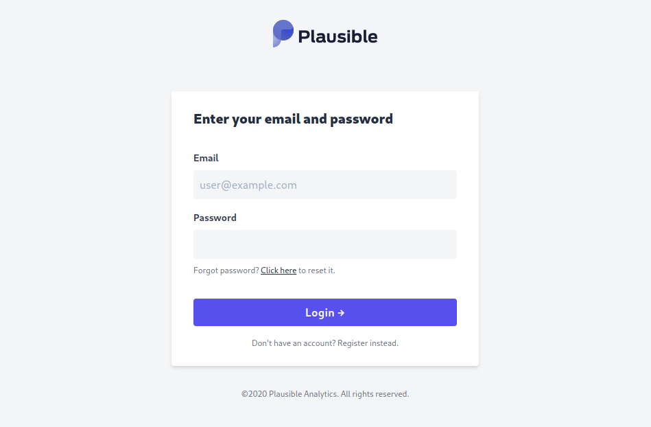

I only recently talked about using [GoAccess]() as an analytics tool. Over the last couple months, I've been more interested in how many hits this website actually gets. GoAccess was a really simple solution which worked on log files and only captured the bits of information I really cared about: Page views.

After hearing about it on [Changelog](https://changelog.com/podcast/396), I looked into [Plausible](https://plausible.io/). It's much more powerful than GoAccess, and is actually designed for analytics. And because it's working in the browser, I don't have to ignore all the static paths to stop them showing up in the analytics.

## Why Plausible

Google Analytics is the current go-to solution for analytics, but it's a non-starter for me due to privacy concerns. The fewer sites collecting information for Google, the better! Plausible positions itself directly as a GDPR-compliant, privacy-driven analytics platform.

Plausible is pretty new to the scene, But what it's achieved in that time is quite remarkable. There's now a functional, simple analytics platform, which collects only the data needed, and isn't tied to a huge company like Google.

[Plausible vs Google Analytics](https://plausible.io/vs-google-analytics)

Plausible's primary offering is a hosted version, but in the last few weeks the option to self-host has been available. The hosted option is rock-solid, running on [renewable energy](https://plausible.io/blog/made-in-eu), and definitely recommended if you don't want to faff for yourself. Using the hosted version also financially supports the project, and ensures it stays around.

## Installation

The current options are to compile and run the Elixir application yourself, or use [Docker](https://hub.docker.com/r/plausible/analytics). My servers already run Docker, so that was a simple decision! In the Plausible repository, there's a `docker-compose.yml` - Don't use it. It's intended more as a reference to what's needed for setup rather than to be used directly. However, from this we can see we need a couple containers:

- [Plausible](https://hub.docker.com/r/plausible/analytics) itself, obviously
- [PostgreSQL](https://hub.docker.com/_/postgres), for the application database
- [Clickhouse](https://hub.docker.com/r/yandex/clickhouse-server), for the analytics database



A cautionary tale for installing Clickhouse. I'd intended to run it on a reasonably old machine (Intel Atom N2800), and due to a requirement on a specific instruction set ([SSE4](https://en.wikipedia.org/wiki/SSE4)), it wouldn't start. Chances are this won't affect you if you're running a server even remotely modern, but something to note.


### Setup and configuration

Fortunately, configuring Plausible is actually really simple and the settings are pretty obvious. There's a [hosting README](https://github.com/plausible/analytics/blob/master/HOSTING.md) in the repository which should definitely be read. Here's what I have set up for Plausible:

```yaml
environment:
  - SECRET_KEY_BASE={{ secret_key }}
  - SIGNING_SALT={{ signing_salt }}
  - DATABASE_URL=postgres://plausible:plausible@db:5432/plausible
  - DISABLE_REGISTRATION=true
  - DISABLE_SUBSCRIPTION=true
  - CLICKHOUSE_DATABASE_HOST=clickhouse
  - CLICKHOUSE_DATABASE_NAME=plausible
  - DATABASE_POOL_SIZE=20
  - CLICKHOUSE_DATABASE_POOLSIZE=20
  - HOST={{ plausible_host }}
  - SCHEME=https
```

`$DISABLE_REGISTRATION` and `$DISABLE_SUBSCRIPTION` are both pretty handy. These prevent other users from signing up to your instance, and stop showing anything to do with subscriptions. For now, the self hosted Plausible comes with a 100-year subscription for admin users, which is very gracious.

`$SECRET_KEY_BASE` and `$SIGNING_SALT` should be kept private at all costs. There's little documentation on what these should be or how to generate them, but according to Phoenix `$SECRET_KEY_BASE` should be at least 64 bytes. `$SIGNING_SALT` just needs to be something reasonably complex, but I used 16 bytes for ease. I used `openssl rand -hex <length>` to securely generate these keys.

Here's my full [`docker-compose.yml`](https://github.com/RealOrangeOne/infrastructure/blob/master/ansible/roles/plausible/files/docker-compose.yml) for reference.

### Migration and admin setup

This is the point we diverge pretty hard from what's defined in both the `docker-compose.yml` and `HOSTING.md` from Plausible. The instructions there note a `setup` container, which is used to initialize Plausible, but then shouldn't be run afterwards. Personally I don't like this pattern, I'd rather the compose file contain exactly what's needed to run the application, no more no less. Instead, we need to set up the databases manually:

1. Start up everything except Plausible itself (`docker-compose up -d db clickhouse`)
2. Enter the Plausible container (`docker-compose run plausible sh`)
3. Create databases (`/entrypoint.sh db createdb`)
4. Run migrations (`/entrypoint.sh db migrate`)
5. Define your user credentials as environment variables:
    - `$ADMIN_USER_NAME`
    - `$ADMIN_USER_EMAIL`
    - `$ADMIN_USER_PWD`
6. Create your admin user (`/entrypoint.sh db init-admin`)

These steps only need to be done once, during application setup. After this, the command must be changed to automatically run migrations on start up. This ensures the database schema and running application are always in sync, and are updated with the container. This can be done by changing the `docker-compose.yml` [like so](https://github.com/RealOrangeOne/infrastructure/commit/384a07b513e42942625df07184ae502957d41013).

Once the migrations have run, stop all the containers (`docker-compose down`), and start the all up as normal (`docker-compose up -d`).

At this point, Plausible should be accessible (however that's configured).



## Installing into website

Now that Plausible is up and running.

The next steps are actually setting it up on your website, by far the easiest step! Plausible has some great documentation on both [creating a site](https://docs.plausible.io/add-website) and [adding the tracker script to your website](https://docs.plausible.io/plausible-script), so there's no point duplicating that here.

Here's how I [added Plausible to this site](https://github.com/RealOrangeOne/theorangeone.net/commit/f87466090e70b819370ef57aa4fd5cd1acefb95a), and then [promptly fixed](https://github.com/RealOrangeOne/theorangeone.net/commit/3ce9f709fbbdb1e986f5ef3c5cadb6ea8cc76002).

## Success

If all's gone according to plan you should now see page hits being tracked by Plausible, running on your own server. Amazing!
