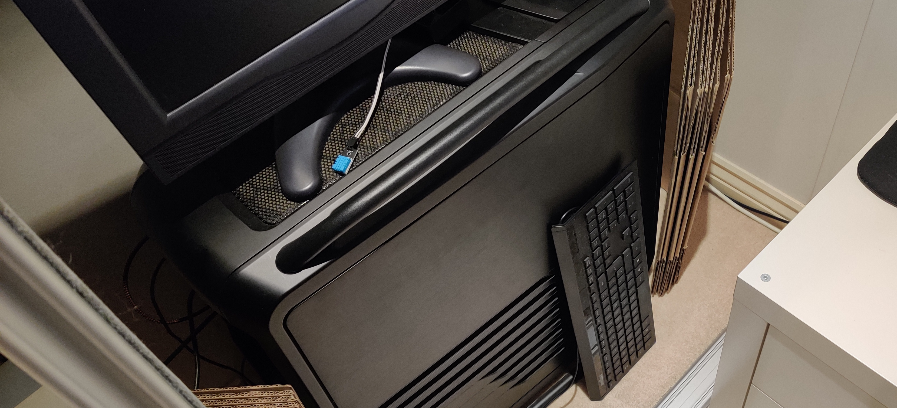

Black Friday, the only day which seems to last over a month, is a great time to buy tech. Whilst most people will be buying early christmas presents, new gadgets for themselves, or just impulse buying stuff they don't need (something I totally never do...), I ordered the parts for my new server. My current home server still works, but it's showing its age more and more. I also needed something to do to kill time over this festive edition of "global pandemic lockdown".

I'd planned to take advantage of the black friday discounts when purchasing, but surprisingly this year there was a lot less on sale in this category than I'd expected, and in fact almost nothing I bought was on a black friday discount.

## Current server

My previous (well, current) server is quite an old one. It was formally my desktop until I moved my dedicated cloud server into my home about 2 years ago. Being an old desktop, the parts choice is far from "server grade", but it gets the job done. For most people starting out with serving things from their home, using an old desktop PC is almost certainly the way to go.

At its heart is an AMD FX-8350. Anyone familiar with that platform knows that the CPUs are pretty powerful, but were old even when they came out, and run rather warm. The case its in is also an interesting one. The Cooler Master Cosmos 2 is _far_ from a small case. It's great for a server as it's got great airflow and tonnes of disk bays. Unfortunately, that means it's huge, and weighs a tonne (25kg **empty**).

The platform itself isn't the most stable. There were times I had **weekly** kernel panics and crashes, and others where certain applications (namely Clickhouse) would completely fall over although there may be [other reasons]() for that).

The OS itself started out as Arch, because the packages I needed were on the AUR and so easy to install. But after discovering the pains that brings, I moved to Ubuntu and Docker. The simplicity of installation and management Docker brings is just great!

## Use case

Whilst I'm a member of [`r/homelab`](https://www.reddit.com/r/homelab), I don't think I'll ever quite understand the need for huge rack for anything practical - besides bragging rights obviously.

I run a lot of applications, but nothing excessively resource-heavy, and most for personal use. I intend to run most applications in Docker (inside LXC), however a few will be in LXC or their own VM for ease of management.

I'd quite like to have a play with [code server](https://coder.com/) as a development environment, and so I'll need something reasonably powerful for that.

## Parts

This system is designed for what I need to do, and the money I have to spend on it. Chances are, your constraints are different to mine. Don't consider this advise on building the exact system I have. Instead, look at it as the thought processes I went through when making the decisions, losing some precious deals.


In lockdown, make sure you change your delivery address from your office (which is a half-hour drive away) to your home. Don't only realise half an hour before the parts are meant to be delivered and have to cancel and re-order.


I've only listed the parts I felt noteworthy, but there's a full parts list (including parts I already had) on [PCPartPicker](https://uk.pcpartpicker.com/user/TheOrangeOne/saved/TLsBjX).

### CPU

The CPU is the heart of a server. It determines how much you can or can't do, and how quickly. Lots of people, especially [serverbuilds.net](https://www.serverbuilds.net/), swear by X99 CPUs and old Xeons. They're great value for VM hypervisor machines like this, and it's much easier to find server-grade motherboards for. The downside however being you're using an older platform, and the CPUs whilst have more cores have a much lower frequency.

I had planned to get something in the Ryzen 3000 series, and take advantage of the price drops after the 5000 series came out. [That didn't happen](https://community.amd.com/t5/processors/ryzen-5000-is-out-of-stock/td-p/255252). Thanks to stock issues, 5000 series chips are nearly impossible to get hold of, so the price drops didn't happen.

In the end I settled on a 3700X. It's a nice balance between being reasonably priced, having a good number of cores and at a reasonable speed. Originally I was tempted by a 3950X, but realised I probably wouldn't take advantage of all the cores to warrant the price delta. 8 cores and 16 threads is still quite a lot, and they'll be much faster in terms of IPC than the 8 cores (and 8 threads) I have currently.

### RAM

I went with 32GB RAM for this, mostly because of ZFS. It's only 3000MHz, but chances are that's fast enough. It's also only 2 DIMMs to allow for future expansion.

I've also **not** gone with ECC support. My thinking being that it's not super necessary nor worth the extra money at this scale. Whilst I've had issues I think are to do with bad memory, I intentionally bought from a brand I trust (Corsair) which I hope is enough.

### Motherboard

The motherboard isn't anything special: B550 TUF from ASUS. My desktop has  TUF-series motherboard, and it's a marker I trust. In a server, you want something solid and reliable. The TUF series has solid power delivery, a decent number of SATA ports, and a decent PCIe layout.

The B550 is nice and new, and doesn't require active cooling.The 2.5GB NIC is probably unnecessary, given my network is just gigabit, but it's nice anyway.



Also, it doesn't have any RGB, which to me is a big feature!

### Storage

Almost all storage is coming from the previous server. All important data lives on a pair of 4TB Seagate Ironwolf drives in a ZFS mirror. My media lives currently on a single 6TB drive (I'll move it to a pool eventually).

The new server boot drive will be a pair of 500GB SSDs, also in a ZFS mirror. These drives will do both boot and primary VM storage. I intend to put in some other existing drives I have around too, both for scratch disk for temp VMs, and some on-disk backups of VMs.

For additional storage expansion, I also bought [an HBA off ebay](https://www.ebay.co.uk/itm/133410496875). Because i'm lazy, it's pre-flashed into IT mode, meaning it simply exposes disks rather than doing its own RAID - something ZFS doesn't play nicely with.

### Case

The Cosmos 2 is a nice case, but it's just too big. I'm starting to much prefer smaller cases to large ones, although an ITX server is just too constrained for my needs, and I didn't need or want separate storage and compute machines.

The Define R6 is a great mid-tower case. It's not too large, nor is it super small. It's got a great internal layout, especially for drives. The drive cages sit in the front with fresh air coming through, and have great cable management options. 6 sleds for 3.5" and 2 for 2.5" should be enough for a while, and it seems you can get more on ebay.



My server currently sits in my wardrobe, immediately adjacent to my bed, making silence incredibly important. The Define range is well known for being quiet, thanks to all the sound-dampening foam. I also picked the one without a window, partly because I don't need the window, but also because the window gets replaced with more foam.

## OS

The largest change for this server upgrade is the OS. Going back the OS I had planned to use for the last wipe, but failed to get working in time (I'm a very impatient person): [Proxmox](https://www.proxmox.com/en/proxmox-ve). Proxmox is a great hypervisor OS capable of running both VMs and LXC containers.

To handle data storage for application VMs, I'm planning on running [FreeNAS](https://www.freenas.org/) in a VM, passing through the drives to that, and then exposing the data via NFS to the rest of the containers. Because proxmox supports ordering VM startup, this is possible, however it does mean that rebooting FreeNAS likely requires rebooting the entire machine. Not ideal but not a dealbreaker.

My intention is to run as much as possible from LXC, only resorting to VMs where absolutely necessary. The lower performance overhead can be quite handy, and you can still run complex systems like Docker just fine.

I've written a [dedicated post]() about how I've set up Proxmox.

## More

So, does this mean there's going to be a load more server setup content coming soon? You're god damn right! [Stay tuned]()!
