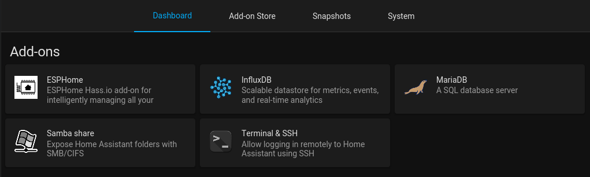
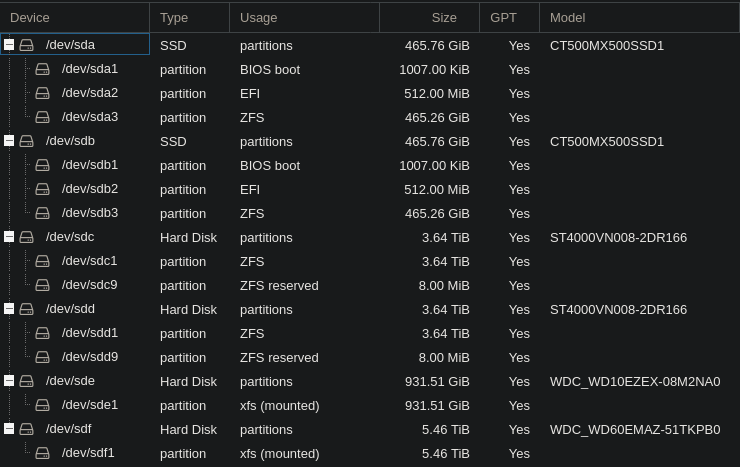

Back in [December](), I fully rebuilt my home server from the ground up based on [Proxmox](https://www.proxmox.com/en/proxmox-ve). Being a hypervisor OS, it makes sense to run everything in VMs or LXC containers, not on the host. Therefore, there's a huge amount of scope for opinions, lessons and customizations.

I've had quite a few people ask exactly how I've set up Proxmox, and the decisions behind it. So, here goes...

## _"Why not just Docker all the things on the host?"_

Before Proxmox, that's exactly what I did. Ubuntu server base OS, running Docker containers for everything. This worked absolutely fine, and for a first-timer that's still the approach I'd recommend. Unfortunately as you scale, it can get more annoying and limiting.

One of the biggest benefits of Proxmox is that it's a hypervisor. It's incredibly simple to spin up a test VM or LXC to start playing around with something. This ability to run multiple isolated "machines" also means applications and environments can be better isolated from each other, and their base OS's selected and tuned perfectly.

As an OS in itself, Proxmox is also really nice. It's Debian based, so it's lightweight, but it also comes packaged with a modern version of ZFS, and extra configuration around cron emailing and ZFS event daemon. All things which I've found annoying to set up in the past, but come free with Proxmox.

## VMs vs LXC

Proxmox lets you create 2 types of virtualized runtime (I'm just going to refer to them as "machines" because it's much easier): VMs and LXC - Each with their own pros and cons.

VMs are virtual machines which you're probably already used to, powered by [QEMU](https://www.qemu.org/). It's a separate OS and a completely separate kernel. Because it's virtualized, it means you can run practically any OS (yes, [even macOS](https://www.youtube.com/watch?v=ATnpEOo3GJA) in theory) in a VM, completely isolated from the host OS. The downside is that because it's an entirely separate OS, there's some additional overhead. Because they're entirely separate, devices such as GPUs, drives or USB controllers have to be passed in entirely. There is support for passing through single HDDs, but I wouldn't recommend it.

[LXC](https://linuxcontainers.org/) on the other hand is very different, and yet fairly similar. LXC containers share the same kernel, resulting in dramatically less overhead and thus greater performance compared to VMs. Think of them like a fancy `chroot` or Docker container (they're not, but just think about it). Because of the shared kernel, LXC containers are constrained to only being Linux, but they can be any distribution you want. Because LXC processes use the same kernel, it means sharing access to things like GPUs and storage is significantly easier, and with less overhead. With LXC, if you want to access some storage on the host, just bind mount it in with almost 0 overhead - No PCI passthrough necessary.

Wherever possible, I try and run LXC containers over VMs, because of the lower overhead and easier to manage resources. There are still places however where it's either easier to run VMs, or I have no choice.

Most of the machines I run are based on Debian, because it's a simple, lightweight distribution with decent package support. I'd prefer to be able to use Alpine for a number of these, but the lack of `glibc` makes running some things much more annoying. Yes I know that's a solvable problem, but at that point it damages stability. With that said, I've recently I've started using Arch for a couple of machines. Yes I know it's a risky move, but I'm familiar with the distribution, and I'd rather have the newer packages for a base, and have everything else keep out the way.

### Docker

Whilst I said I don't like the pattern of a single big VM running everything, I am _sort of_ doing that with my primary Docker host.

Most of the applications I run live here: Yet another Debian LXC container. I had wanted to use Alpine for this, but I could never get Docker working. Docker in LXC is a slightly controversial idea, but it works so well for my needs. There's less overhead than a VM, and passing storage through is easy thanks to bind mounts. For better user id mapping, the container runs privileged (not as bad as it sounds) and has nesting enabled, but there's still more isolation than none.

This container the majority of services I host:

  - [Calibre](https://github.com/janeczku/calibre-web) - Ebook management
  - ~~[Duplicati](https://www.duplicati.com/) - Backups~~ ([not any more]())
  - ~~[Gitea](https://gitea.io/) - `git` repository hosting / mirroring~~ (Recently switched back to [GitLab](https://git.theorangeone.net), in its own LXC container)
  - [Gotify](https://gotify.net/) - Push notifications
  - [Librespeed](https://github.com/librespeed/speedtest) - Network speedtest
  - [Nextcloud](https://nextcloud.com/) - File storage
  - [Privatebin](https://privatebin.info/) - File drops
  - [Quassel](https://quassel-irc.org/) - IRC
  - [Synapse](https://github.com/matrix-org/synapse) - Matrix
  - [Traefik](https://traefik.io/) - Reverse proxy
  - [TT-RSS](https://tt-rss.org/) - RSS feed aggregation
  - [Vaultwarden](https://github.com/dani-garcia/vaultwarden) ([previously Bitwarden_rs](https://github.com/dani-garcia/vaultwarden/discussions/1642)) - Password management
  - [Wallabag](https://www.wallabag.it/) - Links to read later (_honest_)
  - [whoami](https://github.com/traefik/whoami) - Connection testing
  - [YOURLS](https://yourls.org/) - URL shortener

Applications are managed using `docker-compose` in their own directories (e.g. `/opt/bitwarden/docker-compose.yml`). For portability and backup purposes, the data doesn't live alongside it. Instead, that lives on my ZFS pool in tuned datasets.

For updating these applications, I have a [bash script](https://github.com/RealOrangeOne/infrastructure/blob/master/ansible/roles/docker_cleanup/files/docker-utils/update-all) which cycles through all my compose files, pulls new containers, and restarts them if there were changes. Because I pin the applications I care about to specific version tags, the updates should be safe. Changes to tags or the compose file itself are done via Ansible. These patterns ring true for all my machines which run docker - thanks to the power of Ansible.

### Jellyfin

For my media library consumption, I use [Jellyfin](https://jellyfin.org/). I've dabbled with [Plex](https://www.plex.tv/) in the past, but never got used to its authentication mechanism and UI. I used to be a big fan of [Emby](https://emby.media/), but since it [went closed source](https://web.archive.org/web/20181212104719/https://github.com/MediaBrowser/Emby/issues/3479) so suddenly and destroyed its community in the process, I switched as quickly as possible to Jellyfin and haven't looked back.

Jellyfin runs in a Debian LXC, but unlike most of my other machines, isn't running docker - instead it's installed natively through `apt`. Running natively under LXC makes the [GPU passthrough]() much easier, as there's only 2 levels of driver required (host + LXC) rather than 3 (host + LXC + docker). The GTX 760 currently installed is less than optimal, but for now it's good enough for the odd bit of GPU transcoding, and given we're in the middle of a [global GPU shortage](https://www.youtube.com/watch?v=3A4yk-P5ukY), will probably be there a while. Given it's in its own container already, and was always going to be the only thing running, Docker was unnecessary overhead for no real gain.

### Home Assistant

I, much like most selfhosters, run [Home Assistant](https://www.home-assistant.io/). No, I don't do much with it - There are a few ESP devices measuring [temperatures](), but that's about it.

Currently, I run [HomeAssistantOS](https://github.com/home-assistant/operating-system) in a VM. I used to run HomeAssistant core in a container, but I've not played around with a supervised installation before so thought I'd give it a shot. I definitely don't regret the decision. The tight integration with apps, and the snapshot functionality is really handy. Alongside HomeAssistantOS, I run InfluxDB and MySQL for metric storage, and a few other addons.

### qBittorrent

To allow both for slow downloads of _Linux ISOs_, and better seeding, I do most of my torrenting from my server. It's online all the time, and has the storage to handle lots of downloads just fine.

Before about a few weeks ago, I was a pretty happy [Deluge](https://www.deluge-torrent.org/) user. It was a bit buggy, but it worked well enough. Because I wanted to use a recent version, I ran Alpine as the OS and Deluge in Docker. Since trying to connect the machine to a [Mullvad](https://mullvad.net/en/) VPN, Deluge's bugginess became worse and more and more annoying. I'd been considering switching away but never had the motivation to, until now. Time to replace...

The new installation is an Arch VM based on [qBittorrent](https://www.qbittorrent.org/). qBittorrent isn't quite as nice on the eyes, but it's far more powerful than Deluge, and is actively maintained. Because it's now on Arch, I can install qBittorrent through the [Arch repositories](https://archlinux.org/packages/community/x86_64/qbittorrent-nox/), and remove the need for docker entirely - even better!

As mentioned, I connect this machine to a [Mullvad](https://mullvad.net/en/) VPN. The primary reason for this is to mask my home IP. There's no special clients for Mullvad, I just download a WireGuard configuration from Mullvad's website, and specify the forwarded port in qBittorrent's configuration.

To access the downloaded files, I use [nginx](https://github.com/RealOrangeOne/infrastructure/blob/master/ansible/roles/qbittorrent/files/nginx.conf) with auto-index enabled. The access doesn't need to be anything special, but nginx is lightweight and superfast. It means I can use it either through the web UI or tools like [`rclone`](https://rclone.org/).

### Monitoring

Monitoring is a key part of any infrastructure, no matter the scale. It's hard to diagnose anything if you can't see what's going on.

The monitoring machine, a Debian LXC container, is intentionally separate from anything else, so it can do its job more reliably, without any outside interaction. It also means other machines can be restarted without affecting monitoring. For ease of configuration and deployment, everything here runs in Docker.

At the heart of my monitoring is [Prometheus](https://prometheus.io/). Prometheus collects metrics from a bunch of different sources, and stores them for processing. Most of the metrics come from a [Telegraf](https://github.com/influxdata/telegraf) instance running on the Proxmox host, which reports metrics about all VMs and containers. [Traefik](), my reverse proxy of choice, also has a native Prometheus metrics API, so I hook into that too. My [Prometheus config](https://github.com/RealOrangeOne/infrastructure/blob/master/ansible/roles/forrest/files/prometheus/prometheus.yml) defines all these integrations.

Also running on this machine is [InfluxDB](https://www.influxdata.com/), the service I was going to use for metric collection, before [Alex](https://twitter.com/IronicBadger/) convinced me otherwise. It's still installed on the monitoring machine, but it'll be cleaned up some day.

For visualization, I use [Grafana](https://grafana.com/). Really there's little reason to use anything else for me. I can't say I look at the graphs particularly often, but when I need them they're super useful. My primary use for Grafana at the moment is alerting. Yes [alertmanager](https://www.prometheus.io/docs/alerting/latest/alertmanager/) exists, but it's nice to keep graphing and alerting together, especially if it enables [pretty graphs in the email alerts](https://grafana.com/docs/grafana/latest/administration/image_rendering/).

### Ingress

Services are no good if you can't access them, which is where my ingress container comes in. The ingress container serves 2 main purposes: Traffic ingress and VPN ingress.

The first is to allow web traffic to flow to services. I run my [famous WireGuard gateway](), but with an extra step in between. `ingress` terminates the WireGuard connection, but rather than serving the applications itself, uses another HAProxy instance to forward things to Traefik on my Docker host. This way the Docker host doesn't swell further than it needs to.


graph LR

style Home fill:#f7f8fb
style Proxmox fill:#e57000
style VPS fill:#0062ca,color:white
style Docker fill:#0663b8,color:white

A[End Users]
subgraph VPS
B[HAProxy]
C[WireGuard Server]
end

subgraph Home
M[Me]
subgraph Proxmox
subgraph Ingress
D[WireGuard Client]
E[HAProxy]
end
subgraph Docker
F[Traefik]
G[Service 1]
H[Service 2]
I[Service 3]
end
end
end

A-->B
B-->C
C-->D
D-->E
E-->F
F-->G & H & I
M--->E


Alongside the web ingress, there's also a [Nebula]() client. I use Nebula to connect all my servers together, and allow me to access any machine from any of my devices. Because Nebula is a mesh network, it means connections on my LAN stay on my LAN, unlike my previous WireGuard setup.

At home, I use DNS to force traffic to flow locally rather than via my public VPS. The ingress machine is also on my home network, and has a second frontend in HAProxy to allow forwarding traffic on my LAN into Traefik, correctly mapping IPs.

The ingress machine is a very small Debian VM. It's likely possible to do this through LXC, but the better isolation and fact that installing VPNs in a VM is a lot simpler, make it much easier this way. The resource requirements are also tiny, so it's not like the extra performance overheads are actually impacting anything at all. I'd wanted to use Alpine here again, but at the time Nebula wasn't in Alpine's package repositories ([it is now](https://pkgs.alpinelinux.org/packages?name=nebula)).

### DHCP

The DHCP VM does exactly what you think, it runs a DHCP server. But, not for my home network, for the private network inside Proxmox. DHCP, in the form of `dnsmasq`, needs almost no resources, so it's running in the smallest VM I could reasonably make, with Alpine as the base OS.

For additional security and isolation, I run a [private network inside Proxmox](https://blog.jenningsga.com/private-network-with-proxmox/), only accessible to machines running inside it. This way I can both only expose services internally, and also speed up data transfers.

When I originally set up the network, I was feeling lazy, so I set up a DHCP server to handle issuing IPs to throw-away machines. Now, I'm starting to really regret that decision, wishing instead I'd used static IPs and DNS. But that's a project for another day.

## Storage

My storage setup isn't the fanciest, nor the most complicated. It's far from anything which would feel at home on [r/datahorder](reddit.com/r/datahoarder). The most important thing is that I feel confident storing my data on it, without worrying that it's going to suddenly vanish whilst I sleep.

### Disks

#### OS

Proxmox itself is installed on a pair of 500GB SATA SSDs, in a mirrored ZFS pool. This way I get some nice redundancy should a drive fail, and the added benefit of ZFS snapshots and compression for my VMs and containers.

#### `tank`

The bulk of my data lives on a pair of Seagate 4TB HDDs, again in a ZFS mirror. Besides some annoyances with drive stability, this pool has been great. The pool is snapshotted pretty often, and datasets are highly tuned to the data they're storing (databases, bulk storage, config files etc).

Back in October, I had issue with a drive reporting some very bad SMART errors. An advanced RMA with Seagate and the drive was replaced. More recently, I was having another issue, with almost 40,000 checksum errors being reported. After a call with Seagate support and some further diagnosis, it turned out to be an issue with the cables on my HBA. It's still annoying that manufacturers don't recognize ZFS errors as relevant for RMAs, but I'm pretty confident that should a drive fail, the pool itself should be absolutely fine.

#### Media

Perhaps the worst part about my storage setup is my media library: It currently sits on a single (_shucked_) 6TB HDD, with no backups or pooling. I could go with ZFS here, but the added freedom of using any old drive size in the future is quite a benefit, and I wouldn't be needing most of the ZFS features anyway. It still won't be backed up in the same way, but RAID is better than nothing!

#### Scratch

Also in the machine is a single 2TB drive, currently housing Proxmox's ISO library and VM backups. It's some old WD Blue I've had for a while, and I needed somewhere outside the OS drives for Proxmox storage. For a quick setup, this is absolutely fine, as nothing on the drive is especially critical. In the short term, I plan on merging this drive into the upcoming media pool, and moving everything to that.

### Mounting storage

Both my ZFS storage pool and media disk are mounted on the host, and passed in to the relevant LXC containers with bind mounts. In the original setup of this server, I had [TrueNAS](https://www.truenas.com/) setup in a VM to handle storage, and share it around to other VMs via NFS. Whether it be weird bugs, misconfiguration, or the fact I was using an alpha of [TrueNAS SCALE](https://www.truenas.com/truenas-scale/), performance was terrible, to the point of being unusable. Storage on a separate VM also meant that rebooting that VM required rebooting the entire server, which was annoying. Moving storage to the host does require having more configured on the host, but the benefits in performance and reliability are definitely worth it to me.

### ZFS Memory

ZFS is famously quite hungry when it comes to memory consumption. The architecture of ZFS means it'll cache most things in RAM to allow for quicker reads - with the downside memory usage gets pretty high. Whilst I know this cache is useful, personally I'd rather have a bit more free RAM for applications to grow. For this reason I [limit ZFS](https://wiki.gentoo.org/wiki/ZFS#ARC) to around 10GB (1/3 of the total available), meaning there's enough to still be a functional cache, without overwhelming the entire system and everything in it.

## Future

Nothing's ever really "finished", is it. This server has changed quite a lot in the 5 months I've had it, and it'll almost certainly change further over the next 5 months.

There are a couple pain points which are next on my list:

Currently, Nebula [doesn't support](https://github.com/slackhq/nebula/issues/318) specifying a custom DNS server like WireGuard (or more specifically `wg-quick`) does, so routing things with DNS rather than IPs isn't especially clean. Having bookmarks with a load of IPs and ports is my current solution, I'd also like to add some firewalling to the Nebula network, as currently it's far flatter than it really should be.

As mentioned, my media storage isn't great. At some point soon, I really need to get a couple extra drives, and create a pool out of these. My current intention is to use [mergerFS](https://github.com/trapexit/mergerfs) and [snapraid](https://www.snapraid.it/), as recommended by [PMS](https://perfectmediaserver.com/tech-stack/snapraid/), although I am having a few dirty BTRFS-related thoughts, because the compression and integrations aren't something I want to miss out on - even though BTRFS has a very [checkered](https://btrfs.wiki.kernel.org/index.php/Gotchas) past. I'll almost certainly go snapraid, but I'm still keeping an eye out.

As strange as it might sound, I'd like to base fewer things off Debian if I can help it. Debian is a great OS, don't get me wrong, leaps better than Ubuntu, but its reliability comes at the cost of using older releases, and that's a trade-off I'd rather not make for certain things. I've recently become a big fan of Alpine for some use cases, and my most recent VPS provision is based on arch ([I use Arch]() BTW). Debian is working fine, but perhaps the grass running arch is greener.

At some point I'm planning to move Home Assistant over to LXC too, both for the simpler installation and lower overhead. HomeAssistantOS is definitely a fine base OS, but it's very opaque and rather hard to manage in itself.

No idea when I'll get to these, but I'll be [tweeting]() and [blogging]() all the way! I'm also actively working on improving (and documenting) my backup strategy for all my servers, so [stay tuned](/index.xml) for that!
