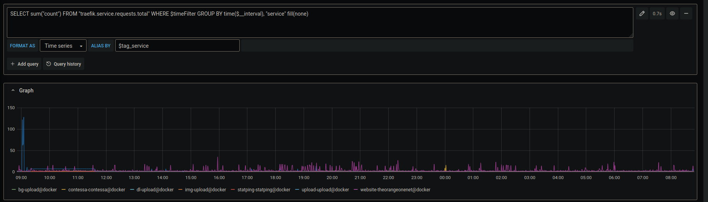

Traefik's dashboard is a great tool to diagnose routing issues, and check services are being detected correctly, but it can't do much more than that. It doesn't show any metrics. Instead, it relies (arguably correctly) on external monitoring tools for metrics.

Traefik supports 4 metric backends: [Datadog](https://docs.traefik.io/observability/metrics/datadog/), [Prometheus](https://docs.traefik.io/observability/metrics/prometheus/), [StatsD](https://docs.traefik.io/observability/metrics/statsd/) and [InfluxDB](https://docs.traefik.io/observability/metrics/influxdb/). [InfluxDB](https://www.influxdata.com/products/influxdb-overview/) is the tool I'm going to be integrating, as I already know how to work with it. I [recently set up](https://github.com/RealOrangeOne/infrastructure/commit/ec751ffa1ad1b5dfe18bc8c3384da0ba8fa75025) Traefik to export metrics into InfluxDB, to then be reported on using Grafana.

## Create an InfluxDB

The first step is to create your InfluxDB instance to store the metric data. For me, I used the [official InfluxDB Docker container](https://hub.docker.com/_/influxdb):

```
influxdb:
  image: influxdb:1.8-alpine
  restart: unless-stopped
  volumes:
    - "./influxdb:/var/lib/influxdb"
```

## Configure InfluxDB for Traefik

By default, Traefik uses UDP to push data into InfluxDB rather than HTTP, due to its lower latency and ["fire and forget"](https://en.wikipedia.org/wiki/Fire-and-forget) nature, although this is configurable. InfluxDB's container doesn't listen for UDP traffic by default, so it'll need to be made to:

```
environment:
  - INFLUXDB_UDP_ENABLED=true
  - INFLUXDB_UDP_DATABASE=traefik
```

### Host mode

Because I run Traefik in host mode, the networking set up is a little different to normal. Usually containers in the same `docker-compose.yml` file can communicate over the default network just fine, but because Traefik is in host mode this doesn't work. Instead, I bind InfluxDB to listen on a local port on the host, and point Traefik at that:

```
ports:
    - "127.0.0.1:38089:8089/udp"
    - "127.0.0.1:38086:8086"
 ```

We expose 2 ports here because Traefik will be using UDP, and Grafana requires HTTP. We could change Traefik to use HTTP, but using the default felt a lot simpler, and reduces overhead.

## Configure Traefik

Traefik now needs to be told to push metrics into our new InfluxDB database. For this, some configuration needs to be added into `traefik.yml`:

```
metrics:
  influxDB:
    address: "127.0.0.1:38089"
    database: traefik
    pushInterval: 60s
```

This tells Traefik to push its metrics into InfluxDB every 60 seconds.

Give Traefik a restart and it should start working, not that you'll be able to see anything. Be sure to check the logs for errors.

## Creating Grafana datasource

Next, we need to create the Grafana data source for InfluxDB. This works in the same way as adding other data sources, just be sure to add the HTTP port (8086) for InfluxDB, not UDP (8089).

## Exploring the data

Using Grafana's "Explore" page, we can take a look at the data being provided by Traefik. There are several metrics output, but the one I focus most on is `traefik.service.requests.total`, which tallies requests for each service.

```
SELECT sum("count") FROM "traefik.service.requests.total" WHERE $timeFilter GROUP BY time($__interval), "service" fill(none)
```

The above query will show you the number of requests per `$__interval` hitting each of your services.



The documentation on what exactly count means is rather absent, but after [some digging](https://godoc.org/github.com/go-kit/kit/metrics/influx#Influx) discovered it's the number of requests hitting the service or entry point between each push from Traefik. I've set this to 1 minute to make calculations and graphing easier, but depending on scale you may want to adjust that, or the `GROUP BY time()` statement.

## Wrapping up

Now, you've got metrics about your Traefik instances into Grafana for future graphing and querying needs. You can set up alerting, cross-reference graphs, and everything else Grafana has to offer.
