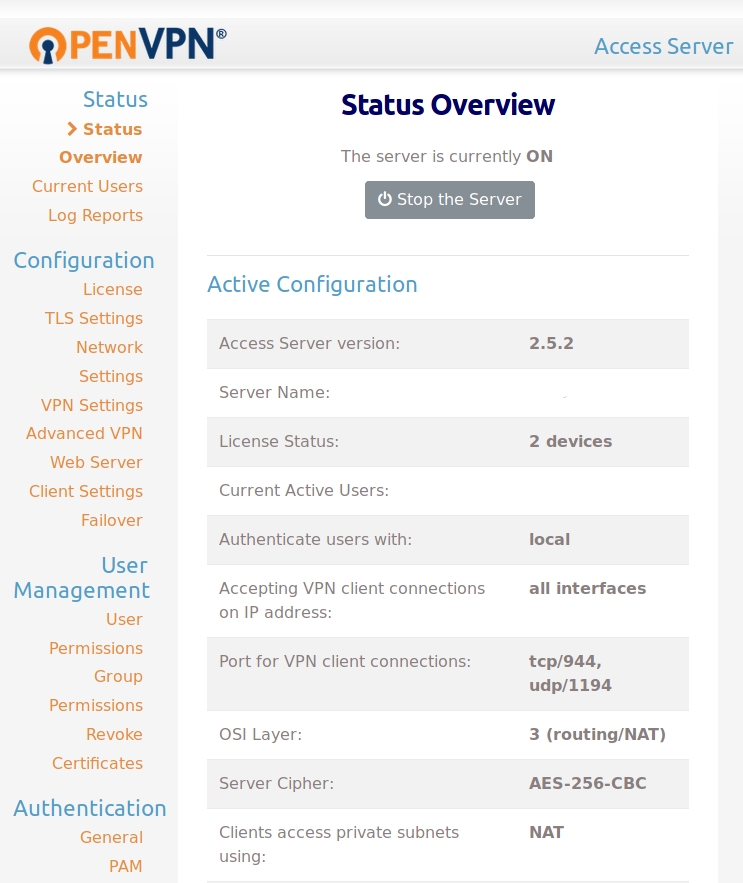
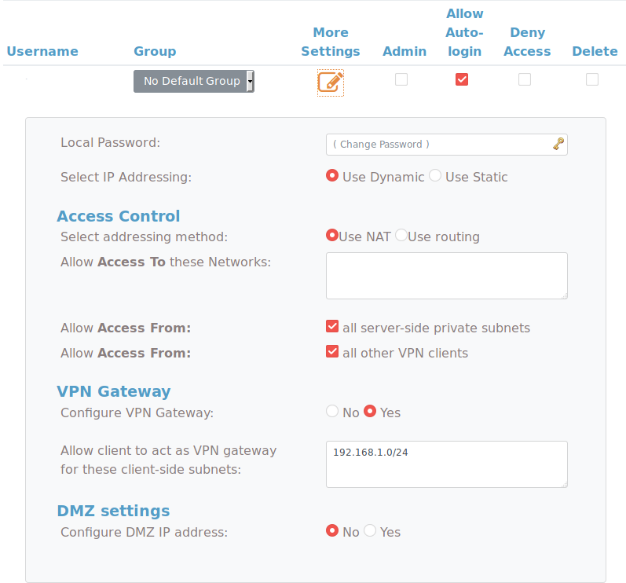

VPNs are a way of accessing application which sit on a separate network using an encrypted tunnel. Contrary to popular belief, they are not designed to anonymize your internet habits. Whilst VPNs are designed to enable a client to access the servers network, it's possible to use them to provide a server to access to its client's network. With this, and a simple HTTP server, it's possible to open up applications on your home network to the internet, without the need for a static IP, or a port forward!


graph LR

A[End Users]
B[VPN Server]

subgraph Home Network
C[VPN Client]
D[Services]
end

A-->B
C---B
C-->D


## Requirements

As with any other VPN network, you'll need two devices, a server and a client

### VPS

The VPS will act as the VPN server, and the external gateway to your internal network. I'll be using [Ubuntu Server](https://www.ubuntu.com/download/server), but any distribution which supports OpenVPN Access Server will also work.

### Internal device

The internal device will connect to the VPN, and allow access to your internal network. A [Raspberry Pi](https://www.raspberrypi.org/) works great for this, which is what I'll be using, but anything which supports the OpenVPN client will work fine; It doesn't need to be a distinct device. As this device will only handle routing traffic and connecting to the VPN, it doesn't have to be powerful. My setup uses a single-core Pi and it never bottlenecks.

## Installation

### Install OpenVPN Access Server

The first step is to install OpenVPN Access Server. The exact command differs depending on the distribution, but they can all be found on the [OpenVPN website](https://openvpn.net/index.php/access-server/overview.html). After installation, be sure to run the `ovpn-init`tool as prompted. At the prompts, answer the questions as below. Many of them, such as the port numbers, can be changed, just substitute them in later on.

```text
Will this be the primary Access Server node?
(enter 'no' to configure as a backup or standby node)
> Press ENTER for default [yes]: yes

Please specify the network interface and IP address to be
used by the Admin Web UI:
(1) all interfaces: 0.0.0.0
(2) ens3: xxx.xxx.xxx.xxx
Please enter the option number from the list above (1-2).
> Press Enter for default [2]: 1

Please specify the port number for the Admin Web UI.
> Press ENTER for default [943]: 943

Please specify the TCP port number for the OpenVPN Daemon
> Press ENTER for default [443]: 443

Should client traffic be routed by default through the VPN?
> Press ENTER for default [yes]: yes

Should client DNS traffic be routed by default through the VPN?
> Press ENTER for default [yes]: no

Use local authentication via internal DB?
> Press ENTER for default [yes]: yes

Should private subnets be accessible to clients by default?
> Press ENTER for default [yes]: yes

Do you wish to login to the Admin UI as "openvpn"?
> Press ENTER for default [yes]: yes
```

OpenVPN Access Server is free for two concurrent users. For this, we only need, so no need to enter a licence key.

Once the script has finished, you'll need to set the password for the builtin user. Run `sudo passwd openvpn` to do this. Open the _"Admin UI"_ URL displayed after the init script. It's probably `https://<ip>:943/admin`. Here, you can log in as the `openvpn` user.



### Create the client account

Once logged in, click _"User Permissions"_ in the sidebar, and create a new user. The user needs to have _"Allow Auto-login"_ enabled, and should not be an admin, for security reasons. Once created, update the running server, and open the _"More Settings"_ tab for the newly created user and set their password. Be sure to save the settings afterwards.

### Setting up the VPN user

The new VPN user needs to be told to allow traffic to flow to other devices on its network. To do this, we need to enable a feature called _"VPN Gateway"_. Under the user settings, switch the related radio button to _Yes_, and enter the subnets you want to be accessible. These should be one per line, and in the format `192.168.1.0/24`. You will also need to enable access from _"all server side private subnets"_ and _"all other VPN clients"_.



### Set up the client device

The client device dependency installation is much simpler. Simply install the OpenVPN client, and you're good to go!

### Getting the client configuration

The OpenVPN client configuration can be downloaded from the access server web UI. Visit `https://<ip>:943/` and log in using the client account. Here you can download the auto-login connection profile, which needs to be placed on the Pi.

### Correctly installing the client configuration

To ensure the connection to the VPN is restarted whenever the Pi is, it needs a systemd service. The OpenVPN client installs a one by default, which can be used with configuration files. The config file needs to be placed at `/etc/openvpn/proxy.conf`. This VPN process can be controlled using the service `openvpn@proxy` (note the filename is the same as everything after the `@`).

Once the file is installed, you need to both start it, and make it start at boot:

```bash
sudo systemctl enable openvpn@proxy
sudo systemctl start openvpn@proxy
```

Check `sudo systemctl status openvpn@proxy` to make sure the connection was successful. You can also check the _"Current Users"_ tab in the access server admin.

### Testing the connection

At this point, you should be able to connect to your home network from your VPN. SSH into your VPN, and run `ip route`. You should see an entry with the subnet you wish to forward. Test it by pinging the local IP of your Pi, and you should have a connection.

```text
$ ping 192.168.1.65 -c 1
PING 192.168.1.65 (192.168.1.65) 56(84) bytes of data.
64 bytes from 192.168.1.65: icmp_seq=1 ttl=64 time=17.9 ms

--- 192.168.1.65 ping statistics ---
1 packets transmitted, 1 received, 0% packet loss, time 0ms
rtt min/avg/max/mdev = 17.936/17.936/17.936/0.000 ms

```

### Enabling access to the rest of your network _(Optional)_

This step may not be required, but was for me, and came after the result of many hours of internet scouring. Now that you can ping your Pi, you _should_ be able to ping the rest of your network. If you can't, then this bit is for you.

There's a [thread](https://forums.whirlpool.net.au/archive/2493314) online describing exactly this issue, and the solution is, as with most of these things, `iptables`. The below command allows the traffic to be routed using NAT to other devices on the interfaces network.

```bash
sudo iptables -t nat -A POSTROUTING -o eno1 -j MASQUERADE
```

Replace `eno1` with the ethernet interface of your Pi, not the VPN one. `iptables` clears its configuration on reboot, so to make sure this rule is automatically applied, you'll need to set up something like [`iptables-persistent`](http://www.microhowto.info/howto/make_the_configuration_of_iptables_persistent_on_debian.html).

## Setting up a reverse proxy

Now that the subnet is accessible on your VPN server, as if it were inside your home network, you can just create a reverse proxy configuration, and put in the local IP of your devices. Be sure to assign them static IPs if you don't want to keep changing the configuration. The below [NGINX config](https://docs.nginx.com/nginx/admin-guide/web-server/reverse-proxy/) will proxy requests to the address `http://foo.example.com` to your internal device at `192.168.1.21`:

```nginx
server {
    listen 80;
    server_name foo.example.com;

    location / {
        proxy_set_header Host $host;
        proxy_pass http://192.168.1.21
    }
}
```

And that's it! No port forwarding, no device enumeration, no service enumeration, no hacks. Any device on your network can be made accessible to the world, but only when you want them to. And because it's forwarding using a VPN, it doesn't have to be simply HTTP traffic!
